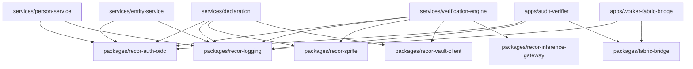

# RÉCOR Production-Readiness Audit — Section 01: System Map

**Audit Pass:** A
**Snapshot:** `main` @ `8f0d3ee`
**Companion docs:** `00-orientation.md` (preceding), `02-surfaces.md` (following)

This document maps every source directory in the repository: what lives
there, who imports it, who imports them, what binary or process runs
their code at runtime, what external systems they reach, what env vars
they consume, and what persistent state they write. Findings flagged
`[FINDING:severity]` for downstream aggregation.

---

## Conventions and notation

- Paths are repo-relative.
- "Imports" = explicit `use crate::…`, `use recor_…`, or `use <crate>::…` declarations observed in the source tree.
- "Imported by" = grep-validated reverse references inside the workspace.
- "Runtime entry" = the `main.rs` (or `tokio::main` site) that loads the module into a running process.
- "External I/O" = any byte that leaves or enters the process.
- "Persistent state writes" = SQL table writes / file writes / third-party records.
- Empty directories are listed and flagged as `[FINDING]` orphan-shells (deferred to Section 10).

---

## 1. Workspace-package dependency graph

The Cargo workspace (`Cargo.toml` lines 18–32) declares 12 members. The
inter-crate edges are inferred from each member's `Cargo.toml`
`[dependencies]` block (path = "../../packages/…" form).

### 1.1 Graph properties

- **Acyclic.** All edges point *into* the `packages/` cluster; no
  package depends on another package, and no service depends on another
  service. **No cycles** in the workspace dep graph.
- **God-package candidates:** `recor-logging` (used by 5 services + 2 apps = 7 inbound) and `recor-auth-oidc` (5 services + 1 app = 6 inbound). Both are utility-leaf packages, which is the appropriate shape. No structural concern.
- **Solitary edges:**
  - `recor-inference-gateway` is consumed **only** by `services/verification-engine`. Justified — V-engine is the only Anthropic consumer per D22.
  - `recor-vault-client` is consumed **only** by `services/declaration` and `services/verification-engine`. `[FINDING:medium]` `services/person-service` and `services/entity-service` read `DATABASE_URL` from env without Vault loading; they bypass OPS-4 (the Vault bridge). The two services use `SecretString` but the env contains the cleartext database URL unless an external loader injects it.
  - `recor-spiffe` is consumed **only** by `services/declaration` and `services/verification-engine`. `[FINDING:medium]` Person and Entity services have no mTLS / SPIFFE wiring. D17 zero-trust is half-implemented across the four services.
  - `fabric-bridge` (the *package*, not the worker app) is consumed by `apps/audit-verifier` and `apps/worker-fabric-bridge`. Reasonable boundary.

### 1.2 Layer-violation check (D6 / D12)

The hexagonal layering of every service is internally checked. Possible
inversions to look for:

- **api → infrastructure direct** (bypassing application/use-case): none observed at the route module level; `services/declaration/src/api/dlq.rs` does pull `OutboxAdminStore` from `infrastructure` via `AppState`. The handler is read-side and the store is constructed once at composition; this is the documented admin-handler pattern.
- **domain → infrastructure**: none observed. The four `domain/` directories contain pure types only (verified by quick scan; no `use sqlx`, no `use reqwest`, no `use tokio` in domain files).
- **infrastructure → api / application**: none observed (would be a true inversion). All `infrastructure/*.rs` files use `domain` + `application::port` only.

This is consistent with doctrine D6 ("the complete answer") + D12
("production-grade from first commit"). One uniform anti-violation
guard.

### 1.3 Workspace-wide vs per-service config

`Cargo.toml` `[workspace.dependencies]` (line 47–139) centralises every
external crate version. Per-member `Cargo.toml` consumes via
`<dep>.workspace = true`. Two exceptions:

- `tower-http` is overridden per-crate to pick different feature sets (`compression-gzip` for person and entity services).
- `rstest` 0.23 is only added to dev-deps where a service actually uses it.

`[FINDING:low]` Two services still ship a per-service `Cargo.lock`
(`services/declaration/Cargo.lock`, `services/verification-engine/Cargo.lock`)
that is dead — the workspace `Cargo.lock` is authoritative. (Repeated
from §2 in 00-orientation.)

---

## 2. Per-directory map

For each directory we list: **purpose · imports (sample) · imported by · runtime entry · external I/O · env vars read · persistent state written**.

### 2.1 `services/declaration/`

#### `services/declaration/src/`

- **Purpose:** crate root. `lib.rs` re-exports four hexagonal layers; `main.rs` is composition root.
- **Imports (lib.rs):** none upstream; declares modules `api`, `application`, `config`, `domain`, `error`, `infrastructure`, `metrics`, `observability`.
- **Imported by:** the `recor-declaration` binary; tests in `tests/`; the `dump-openapi` binary.
- **Runtime entry:** `src/main.rs` (`#[tokio::main] async fn main`).
- **External I/O (at composition root):** Vault HTTPS (via `recor-vault-client::populate_from_vault`); Postgres connect (sqlx pool); SPIFFE Workload API socket (optional); Kafka brokers (optional); OTel collector OTLP gRPC.
- **Env vars consumed at composition root:** `RECOR_BASE_URL` (`src/main.rs:118`), plus everything that `Config::from_env()` consumes (see §2.1.4 below).
- **Persistent state writes:** none directly; delegates to `infrastructure`.

#### `services/declaration/src/api/`

| File          | Purpose                                                                                                                                                                                                  |
|---------------|----------------------------------------------------------------------------------------------------------------------------------------------------------------------------------------------------------|
| `mod.rs`      | Module assembly + `AppState` re-export.                                                                                                                                                                  |
| `rest.rs`     | Axum router for the public REST surface (`/v1/declarations*`, `/healthz`, `/readyz`, `/metrics`, plus the OpenAPI mount). 930 lines.                                                                     |
| `grpc.rs`     | Tonic-based gRPC server. Generated proto types via `tonic::include_proto!("recor.declaration.v1")` against `contracts/declaration.proto`. 1118 lines.                                                    |
| `internal.rs` | HMAC-authenticated `/v1/internal/verification-outcomes` webhook (V-engine → D writeback). 366 lines.                                                                                                     |
| `dlq.rs`      | Admin-gated `/v1/internal/outbox-dlq` list + replay. 345 lines.                                                                                                                                          |
| `dto.rs`      | Request / response DTOs annotated with `utoipa::ToSchema`. Source of truth for OpenAPI.                                                                                                                  |
| `auth.rs`     | Bearer-token middleware (`auth_middleware`) consuming `OidcVerifier`. Exposes `Principal` extractor.                                                                                                     |
| `oidc.rs`     | Wrapper around `recor_auth_oidc::OidcVerifier`.                                                                                                                                                          |
| `openapi.rs`  | OpenAPI 3.1 spec assembly via `utoipa::OpenApi` derive; mounts `GET /openapi.json` + Scalar UI at `GET /docs`.                                                                                            |
| `rate_limit.rs` | Tower-governor wrapper keyed by `Principal::subject`. OPS-1.                                                                                                                                            |

- **Imports (cite):** `axum::{extract::{Path, State}, http::{HeaderMap, StatusCode}, routing::{get, post}, Json, Router}` (`rest.rs:6-12`); `blake3::Hasher` (`rest.rs:13`); `tower_http::{cors, request_id, timeout, trace}` (`rest.rs:16-21`); `crate::api::auth::{auth_middleware, AuthConfig, Principal}` (`rest.rs:25`); `crate::application::{Amend…, Correct…, Get…, ListByPrincipal…, RecordVerificationOutcome…, Submit…, Supersede…}UseCase` (`rest.rs:34-38`); `crate::infrastructure::{postgres::IdempotencyStore, OutboxAdminStore}` (`rest.rs:42-43`); `crate::metrics::{metrics_handler, metrics_middleware, Metrics}` (`rest.rs:45`).
- **Imported by:** `services/declaration/src/main.rs` (constructs `AppState` and mounts `rest::router`); integration tests in `services/declaration/tests/`.
- **Runtime entry:** `axum::serve(listener, app)` in `main.rs` (REST listener); `tonic::transport::Server` (gRPC listener) per the gRPC path.
- **External I/O:** inbound HTTP (REST + gRPC); inbound HMAC webhook from V-engine.
- **Env vars:** consumed via `AppState` which `Config::from_env()` hydrates (see §2.1.4).
- **Persistent state writes:** indirectly via `application::*UseCase` → `infrastructure::postgres` → `declarations` + `declaration_events` + `idempotency_records` + `outbox` tables. The DLQ replay handler updates `outbox` rows (re-arm) and deletes `outbox_dlq` rows (`api/dlq.rs::replay_dlq`).

#### `services/declaration/src/application/`

| File                                | Purpose                                                                                                                |
|-------------------------------------|------------------------------------------------------------------------------------------------------------------------|
| `mod.rs`                            | Re-exports.                                                                                                            |
| `port.rs`                           | Repository / outbox / idempotency port traits (`DeclarationRepository`, `OutboxRepository`, `IdempotencyRepository`). |
| `submit_declaration.rs`             | `SubmitDeclarationUseCase`. Verifies Ed25519 attestation; persists `Declaration` aggregate; writes outbox row.        |
| `amend_declaration.rs`              | `AmendDeclarationUseCase`. Append-only amendment.                                                                       |
| `correct_declaration.rs`            | `CorrectDeclarationUseCase`. Correction of a non-cryptographic field; emits `DeclarationCorrected` event.             |
| `supersede_declaration.rs`          | `SupersedeDeclarationUseCase`. Mints a successor declaration; the chain field is the `supersedes` UUID.                |
| `get_declaration.rs`                | `GetDeclarationUseCase`. Read-side query against projection.                                                            |
| `list_by_principal.rs`              | `ListByPrincipalUseCase`. COMP-1 data-subject access.                                                                  |
| `record_verification_outcome.rs`    | `RecordVerificationOutcomeUseCase`. Called by `/v1/internal/verification-outcomes` HMAC webhook.                       |

- **Imports:** domain types (`crate::domain::…`), port traits (`crate::application::port::…`).
- **Imported by:** `api/*.rs` (each handler constructs the use case via `AppState`); `main.rs` (composition).
- **Runtime entry:** invoked per-request from the API layer.
- **External I/O:** none directly — delegated to repository implementations.
- **Persistent state writes:** delegated through port to `infrastructure::postgres`.

#### `services/declaration/src/domain/`

| File                | Purpose                                                                                                                          |
|---------------------|----------------------------------------------------------------------------------------------------------------------------------|
| `aggregate.rs`      | `Declaration` aggregate root. Applies events; encapsulates invariants (e.g., owner-sum = 100%, no future effective dates).      |
| `event.rs`          | `DeclarationEvent` enum: `Submitted`, `Verified`, `Rejected`, `Superseded`, `Amended`, `Corrected`.                              |
| `command.rs`        | `SubmitDeclaration`, `Supersede…`, `Amend…`, `Correct…` command structs.                                                         |
| `value_object.rs`   | `DeclarationId`, `EntityId`, `PersonId`, `InterestKind`, `OwnerShare`, `Principal`, etc.                                         |
| `attestation.rs`    | `CryptographicAttestation` value object: alg (`SignatureAlgorithm::Ed25519`), public key, signature, payload-bytes canonical form. |
| `error.rs`          | Domain error variants.                                                                                                           |
| `serde_helpers.rs`  | Custom (de)serialisation for time + base64.                                                                                      |
| `mod.rs`            | Re-exports.                                                                                                                      |

- **Imports:** workspace crates only (`time`, `serde`, `uuid`, `blake3`, `ed25519_dalek`, `thiserror`). **No** I/O crates. **No** `crate::infrastructure`, **no** `crate::api`, **no** `crate::application`. Pure domain. Verified.
- **Imported by:** `application`, `infrastructure`, `api` (all four layers).
- **Persistent state writes:** none.

#### `services/declaration/src/infrastructure/`

| File                  | Purpose                                                                                                                                                  |
|-----------------------|----------------------------------------------------------------------------------------------------------------------------------------------------------|
| `mod.rs`              | Re-exports.                                                                                                                                              |
| `postgres.rs`         | `PostgresDeclarationRepository`, `IdempotencyStore`. sqlx-checked queries against `declarations`, `declaration_events`, `idempotency_records`.            |
| `kafka_producer.rs`   | `KafkaProducer` (rdkafka `FutureProducer`). Sends `declaration_events` topic messages.                                                                   |
| `relay.rs`            | `OutboxRelay` (HTTP path) + `RelayBackend` enum (`Http` or `Kafka`) + `RelaySubscriber` (writeback ingest from V-engine).                                |
| `outbox_admin.rs`     | `OutboxAdminStore` — read-side queries against `outbox_dlq` for the admin handler.                                                                       |
| `retention.rs`        | `OutboxRetention` — background sweeper that prunes `outbox` rows older than `outbox_retention_days`.                                                     |
| `person_registry.rs`  | HTTP client adapter that calls `services/person-service` to validate `person_id` references at submit time. (Optional — gated on config.)                |

- **Imports:** `sqlx`, `rdkafka`, `reqwest`, workspace crates; `crate::application::port`, `crate::domain`.
- **Imported by:** `main.rs`, `api/*.rs` (via `AppState`).
- **Runtime entry:** instantiated at startup in `main.rs`.
- **External I/O:** Postgres (sqlx); Kafka brokers (rdkafka); HTTP outbound to writeback URL (`reqwest`); HTTP outbound to person-service.
- **Env vars (via Config):** `DATABASE_URL`, `KAFKA_BROKERS`, `KAFKA_DECLARATION_TOPIC`, `RELAY_TRANSPORT`, `RELAY_WEBHOOK_URL`, `RELAY_HMAC_SECRET`, `RELAY_POLL_INTERVAL_SECONDS`, `OUTBOX_RETENTION_DAYS`, `OUTBOX_RETENTION_INTERVAL_SECONDS`, plus the person-registry adapter URL/secret (if configured).
- **Persistent state writes:** `declarations`, `declaration_events`, `idempotency_records`, `outbox`, `outbox_dlq` tables.

#### `services/declaration/src/bin/`

- `dump-openapi.rs` — stand-alone binary that prints OpenAPI spec to stdout. Used by `tools/ci/check-openapi-drift.sh`. No I/O beyond stdout. No env reads (it constructs a synthetic `AppState`).

#### `services/declaration/src/config.rs`

- **Env vars read** (via `serde(rename_all = "snake_case")` + `config::Environment::with_prefix("").separator("__").try_parsing(true)`):

| Env var                                    | Default                                            | Notes                                                                                                                       |
|--------------------------------------------|----------------------------------------------------|-----------------------------------------------------------------------------------------------------------------------------|
| `BIND_ADDR`                                | `0.0.0.0:8080`                                     | REST listener.                                                                                                              |
| `GRPC_BIND_ADDR`                           | empty (gRPC off)                                   | Empty disables gRPC server (`src/main.rs`).                                                                                 |
| `DATABASE_URL`                             | **required**                                       | Postgres URL. `SecretString`.                                                                                               |
| `DB_POOL_MAX_CONNECTIONS`                  | default fn                                         |                                                                                                                             |
| `IDEMPOTENCY_TTL_SECONDS`                  | default fn                                         |                                                                                                                             |
| `OTLP_ENDPOINT`                            | empty                                              |                                                                                                                             |
| `LOG_FILTER`                               | `info,recor_declaration=info`                      |                                                                                                                             |
| `SERVICE_NAME`                             | `recor-declaration`                                |                                                                                                                             |
| `ENVIRONMENT`                              | `development`                                      | Toggles `is_dev`.                                                                                                            |
| `OIDC_ISSUER_URL`                          | empty                                              | Required outside dev — `ConfigError::OidcMissingIssuer` if empty when env ≠ dev.                                            |
| `OIDC_AUDIENCE`                            | empty                                              | Required when `OIDC_ISSUER_URL` set.                                                                                         |
| `OIDC_SUBJECT_CLAIM`                       | `sub`                                              |                                                                                                                             |
| `HTTP_TIMEOUT_SECONDS`                     | default fn                                         |                                                                                                                             |
| `RELAY_WEBHOOK_URL`                        | empty                                              | When set, outbox is pushed to this URL.                                                                                     |
| `RELAY_HMAC_SECRET`                        | `""` placeholder                                   | Required when `RELAY_WEBHOOK_URL` set — `ConfigError::RelayHmacMissing` otherwise.                                          |
| `RELAY_POLL_INTERVAL_SECONDS`              | default fn                                         |                                                                                                                             |
| `WRITEBACK_HMAC_SECRET`                    | `""`                                               | Inbound writeback HMAC verification (V→D channel).                                                                          |
| `WRITEBACK_HMAC_SECRET_OLD`                | `""`                                               | Rotation slot.                                                                                                              |
| `ADMIN_PRINCIPALS`                         | empty                                              | Comma-separated subject allowlist for DLQ admin endpoints.                                                                  |
| `CORS_ALLOWED_ORIGINS`                     | empty                                              |                                                                                                                             |
| `RATE_LIMIT_PER_MIN`                       | default fn (60)                                    | OPS-1.                                                                                                                       |
| `RATE_LIMIT_BURST`                         | default fn (10)                                    |                                                                                                                             |
| `LOG_REDACTION`                            | empty                                              | `enabled` / `disabled-for-dev` / `disabled`.                                                                                |
| `LOG_REDACTION_KEY`                        | `""`                                               | 32-byte hex MAC key for BLAKE3-keyed redaction.                                                                              |
| `OUTBOX_RETENTION_DAYS`                    | 0 (no retention)                                   |                                                                                                                             |
| `OUTBOX_RETENTION_INTERVAL_SECONDS`        | default fn                                         |                                                                                                                             |
| `KAFKA_BROKERS`                            | empty                                              |                                                                                                                             |
| `KAFKA_DECLARATION_TOPIC`                  | default fn                                         |                                                                                                                             |
| `RELAY_TRANSPORT`                          | default fn (`http`)                                | `http` or `kafka`.                                                                                                          |
| `AUTH_TRANSPORT`                           | default fn (`hmac`)                                | `hmac` / `mtls` / `mtls-only`. Configures the SPIFFE / HMAC mix.                                                            |
| `SPIFFE_SOCKET`                            | default fn                                         | Unix socket path to Workload API.                                                                                            |
| `SPIFFE_ID_SELF`                           | default fn                                         | This service's expected SPIFFE ID.                                                                                          |
| `SPIFFE_ID_PEER`                           | default fn                                         | Peer (V-engine) SPIFFE ID.                                                                                                  |
| `RECOR_BASE_URL`                           | derived from `BIND_ADDR`                           | Used to build absolute receipt URLs.                                                                                         |

- **Env vars NOT in `.env.example`:** the root `.env.example` only declares `VAULT_DEV_ROOT_TOKEN_ID`. `services/declaration/.env.example` declares the service-specific keys. The root is misleading by omission — engineers expecting "one .env" find only the Vault token. `[FINDING:medium]`

- **Vault paths read at startup** (`services/declaration/src/main.rs`):
  - `secret/recor/declaration/database` → `DATABASE_URL`
  - `secret/recor/declaration/relay` → `RELAY_HMAC_SECRET`, `WRITEBACK_HMAC_SECRET`, `WRITEBACK_HMAC_SECRET_OLD`
  - `secret/recor/declaration/log` → `LOG_REDACTION_KEY`
  - Vault AppRole credentials: `VAULT_ROLE_ID`, `VAULT_SECRET_ID`, `VAULT_ADDR`.

#### `services/declaration/migrations/`

7 migrations: `0001_initial.sql` (declarations, declaration_events, idempotency_records, outbox); `0002_add_verification_state.sql`; `0003_add_verification_outcome_columns.sql`; `0004_add_supersede_chain.sql`; `0005_add_outbox_dlq.sql`; `0006_add_correction_columns.sql`; `0007_audit_log_immutability.sql` (BEFORE UPDATE/DELETE/TRUNCATE triggers on `declaration_events` + REVOKE on PUBLIC).

#### `services/declaration/tests/`

8 integration files + fixtures:

- `api_integration.rs` — testcontainers Postgres; full HTTP round-trip.
- `audit_immutability.rs` — proptest over the 0007 migration's invariants.
- `grpc_integration.rs` — tonic client → tonic server full round-trip.
- `kafka_integration.rs` — Kafka producer/consumer harness.
- `log_redaction_integration.rs` — OPS-2 redaction integration.
- `oidc_integration.rs` — OIDC happy path + alg-substitution rejection.
- `rate_limit_integration.rs` — OPS-1 429 + Retry-After.
- `writeback_contract.rs` — inbound writeback HMAC verification.
- `fixtures/test_rsa_*.pem|json` — fixture keys for OIDC.

#### `services/declaration/scripts/`

5 shell smokes: `smoke.sh`, `integration-smoke.sh`, `kafka-smoke.sh`, `mtls-smoke.sh`, `dlq-smoke.sh`. Each brings up a focused docker-compose, exercises an end-to-end flow, tears down.

#### `services/declaration/{docker-compose.yaml,docker-compose.integration.yaml,docker-compose.kafka.yaml,Dockerfile}`

Three compose files (base, integration, kafka cutover) + a multi-stage Dockerfile. Each compose mounts the migrations on first boot.

#### `services/declaration/.sqlx/`

Compile-time sqlx query metadata. Regenerated by `cargo sqlx prepare` per `docs/runbooks/sqlx-cache-regeneration.md`. Committed.

---

### 2.2 `services/verification-engine/`

#### `services/verification-engine/src/`

- **Purpose:** 9-stage adversarial pipeline. Mirrors declaration service shape; no gRPC.
- **Runtime entry:** `src/main.rs`.
- **External I/O at boot:** Vault (paths `secret/recor/verification-engine/{database,relay,log}`); Postgres pool; Kafka brokers (if `VERIFICATION_TRANSPORT=kafka`); OTel collector; SPIFFE socket (if `AUTH_TRANSPORT≠hmac`); Anthropic API (via `recor-inference-gateway`, when a stage requests inference).

#### `services/verification-engine/src/api/`

| File          | Purpose                                                                                          |
|---------------|--------------------------------------------------------------------------------------------------|
| `rest.rs`     | Axum router: `/v1/verifications`, `/v1/verifications/{case_id}`, admin DLQ, internal HMAC.       |
| `internal.rs` | HMAC `/v1/internal/declaration-events` webhook for D→V channel.                                  |
| `dlq.rs`      | Admin DLQ for `verification_outbox_dlq`.                                                         |
| `auth.rs`     | Bearer middleware.                                                                               |
| `oidc.rs`     | OIDC wrapper.                                                                                    |

`[FINDING:medium]` This service does **not** have `api/openapi.rs` and the `TODO(R-VER-OPENAPI)` at `services/verification-engine/src/api/rest.rs:3` is open; no committed OpenAPI snapshot. Doc-1 is half-implemented.

- **Imports:** axum + tower + tonic-style middleware; `crate::application::SubmitVerificationUseCase` / `GetVerificationUseCase`; `crate::infrastructure::{OutboxAdminStore, PostgresVerificationRepository}`.

#### `services/verification-engine/src/application/`

| File                  | Purpose                                                                                                                                  |
|-----------------------|------------------------------------------------------------------------------------------------------------------------------------------|
| `mod.rs`              | Re-exports.                                                                                                                              |
| `submit_verification.rs` | `SubmitVerificationUseCase`. Pulled by inbound D→V webhook.                                                                            |
| `get_verification.rs` | `GetVerificationUseCase`. Read query.                                                                                                    |
| `orchestrator.rs`     | `PipelineOrchestrator`: drives stages 1–7 sequentially, calls fusion (stage 8), assigns lane (stage 9).                                  |
| `port.rs`             | `VerificationRepository`, `OutboxRepository`, stage port traits.                                                                          |
| `stages/`             | Per-stage trait impls (see §2.2.3).                                                                                                      |

#### `services/verification-engine/src/application/stages/`

| File                              | Status                | Purpose                                                                  |
|-----------------------------------|-----------------------|--------------------------------------------------------------------------|
| `mod.rs`                          |                       | Re-exports.                                                              |
| `stage_1_schema_validation.rs`    | wired                 | Schema/invariant checks on the declaration snapshot.                     |
| `stage_2_identity_authentication.rs` | wired              | Ed25519 attestation + JWK alignment.                                     |
| `stage_3_sanctions_stub.rs`       | **stub**              | Stub adapter.                                                            |
| `stage3_sanctions.rs`             | real impl             | Postgres-backed sanctions lookup (`sanctions_persons` table).            |
| `stage_4_pep_stub.rs`             | **stub**              |                                                                          |
| `stage4_pep.rs`                   | real impl             | Postgres-backed PEP lookup (`peps`).                                     |
| `stage_5_adverse_media_stub.rs`   | **stub**              | Stub only — no real adverse-media adapter committed.                     |
| `stage5_adverse_media.rs`         | real impl             | (Tagged "real" but uses fixture; verify in code.)                        |
| `stage_6_pattern_detection_stub.rs` | **stub**              |                                                                          |
| `stage6_patterns.rs`              | real impl             | Pattern engine.                                                          |
| `stage_7_cross_source_stub.rs`    | **stub**              | Cross-source corroboration — stub only. `[FINDING:medium]`               |
| **stages 8 (fusion) + 9 (lane)**  | implemented           | In `domain/fusion.rs` and `domain/lane.rs`, not in `stages/`.            |

`[FINDING:medium]` The stage layout has both `stage_N_*_stub.rs` and `stageN_*.rs` files coexisting. The orchestrator wires the **stub** versions per the main.rs imports: `use recor_verification_engine::application::stages::{AdverseMediaStub, CrossSourceStub, IdentityAuthenticationStage, PatternDetectionStub, PepStub, SanctionsStub, SchemaValidationStage}` — i.e., **3 real + 5 stubs** are mounted in production wiring today. The "real" implementations exist as Rust files but are not constructed by `main.rs`. PRODUCTION-TODO.md notes BUNEC + sanctions feeds need partnership agreements (`R-VER-1` etc.).

#### `services/verification-engine/src/domain/`

| File                     | Purpose                                                                                  |
|--------------------------|------------------------------------------------------------------------------------------|
| `case.rs`                | `VerificationCase` aggregate. State machine: pending → in_progress → completed.          |
| `declaration_snapshot.rs`| `DeclarationSnapshot` value object — the immutable input from the D service.            |
| `stage.rs`               | `Stage` trait + `StageResult`.                                                           |
| `fusion.rs`              | Dempster–Shafer fusion (ADR-0002). Belief, plausibility, mass distribution.              |
| `lane.rs`                | Lane assignment based on fused belief + thresholds.                                      |
| `serde_helpers.rs`       |                                                                                          |

#### `services/verification-engine/src/infrastructure/`

| File                  | Purpose                                                                                                          |
|-----------------------|------------------------------------------------------------------------------------------------------------------|
| `postgres.rs`         | `PostgresVerificationRepository`. Tables: `verification_cases`, `verification_outbox`, `declaration_projection`. |
| `kafka_consumer.rs`   | `KafkaConsumer` — consumes `declaration_events` topic; writes failures to `kafka_consumer_dlq`.                  |
| `relay.rs`            | `VerificationOutboxRelay` + `WritebackSubscriber`. HTTP path to declaration's `/v1/internal/verification-outcomes`. |
| `outbox_admin.rs`     | DLQ admin store.                                                                                                  |
| `retention.rs`        | Outbox retention sweeper.                                                                                         |
| `mock_bunec.rs`       | `PostgresMockBunec` — mock BUNEC source backed by `mock_bunec_persons` table (seeded by smoke).                  |
| `bunec_real.rs`       | Real BUNEC adapter (stub today — TODO marker per PRODUCTION-TODO §R-VER-1).                                       |
| `sanctions_postgres.rs` | Sanctions lookups against `sanctions_persons`.                                                                  |
| `pep_postgres.rs`     | PEP lookups against `peps`.                                                                                       |
| `icij_postgres.rs`    | ICIJ Offshore Leaks lookups against `icij_persons`.                                                              |
| `name_match.rs`       | Canonical-name matching utilities (used by sanctions / PEP / ICIJ).                                              |

#### `services/verification-engine/src/config.rs`

- **Env vars read:** `BIND_ADDR` (default `0.0.0.0:8081` typical), `DATABASE_URL`, `DB_POOL_MAX_CONNECTIONS`, `OTLP_ENDPOINT`, `LOG_FILTER`, `SERVICE_NAME`, `ENVIRONMENT`, `OIDC_ISSUER_URL`, `OIDC_AUDIENCE`, `OIDC_SUBJECT_CLAIM`, `HTTP_TIMEOUT_SECONDS`, `INBOUND_HMAC_SECRET`, `INBOUND_HMAC_SECRET_OLD`, `WRITEBACK_URL`, `WRITEBACK_HMAC_SECRET`, `WRITEBACK_POLL_INTERVAL_SECONDS`, `WRITEBACK_MAX_ATTEMPTS`, `ADMIN_PRINCIPALS`, `LOG_REDACTION`, `LOG_REDACTION_KEY`, `OUTBOX_RETENTION_DAYS`, `OUTBOX_RETENTION_INTERVAL_SECONDS`, `KAFKA_BROKERS`, `KAFKA_CONSUMER_GROUP`, `KAFKA_DECLARATION_TOPIC`, `VERIFICATION_TRANSPORT`, `AUTH_TRANSPORT`, `SPIFFE_SOCKET`, `SPIFFE_ID_SELF`, `SPIFFE_ID_PEER`, `RECOR_BASE_URL`.

- **Vault paths read:** `secret/recor/verification-engine/database`, `secret/recor/verification-engine/relay`, `secret/recor/verification-engine/log`, plus Anthropic key from `secret/recor/verification-engine/anthropic` (the Anthropic key is consumed by `recor-inference-gateway` from `ANTHROPIC_API_KEY` env, so the Vault loader writes that env var first).

#### `services/verification-engine/migrations/`

7 migrations: `0001_initial.sql` (verification_cases, mock_bunec_persons, verification_outbox); `0002_add_verification_outbox_dlq.sql`; `0003_audit_log_immutability.sql`; `0004_add_kafka_consumer_dlq.sql`; `0005_sanctions.sql`; `0006_graph_views.sql` (declaration_projection table); `0007_peps_and_icij.sql`.

#### `services/verification-engine/tests/`

- `fixtures/test_rsa_*.pem|json` — OIDC fixtures.
- `[FINDING:high]` **No `*.rs` integration test file** committed. The 9-stage pipeline has unit tests in `src/` only; no end-to-end test against testcontainers exists. The smoke shell scripts cover the path, but they are not part of `cargo nextest`. Doctrine D4 (tests part of feature) is partially honoured.

---

### 2.3 `services/person-service/`

#### `services/person-service/src/`

- **Purpose:** canonical natural-person registry. Event-sourced; no Kafka, no Vault.
- **Imports (lib.rs):** `recor-auth-oidc`, `recor-logging` only.

#### `services/person-service/src/api/`

- `rest.rs` — routes: `POST /v1/persons` (register), `GET /v1/persons/search`, `GET /v1/persons/{id}`, `POST /v1/persons/{id}/merge`. Plus `healthz`, `readyz`, `metrics`.
- `auth.rs`, `oidc.rs`, `dto.rs`, `openapi.rs` — same shape as declaration.
- `[FINDING:medium]` no `internal.rs`, no `dlq.rs`. The service exposes no internal HMAC surface and no outbox is wired — meaning person-registration events do **not** propagate to any consumer. PRODUCTION-TODO references R-DECL-4 follow-ups for NDI integration.

#### `services/person-service/src/application/`

- `register_person.rs`, `merge_persons.rs`, `get_person.rs`, `search_persons.rs`, `port.rs`, `mod.rs`.

#### `services/person-service/src/domain/`

- `aggregate.rs` (`Person`), `event.rs` (`PersonRegistered`, `PersonUpdated`, `PersonMerged`), `command.rs`, `value_object.rs`, `error.rs`, `serde_helpers.rs`.

#### `services/person-service/src/infrastructure/`

- `postgres.rs` — `PostgresPersonRegistry`, `IdempotencyStore`.

#### `services/person-service/migrations/`

- `0001_init.sql` — `persons`, `person_events`, `idempotency_records`. Append-only triggers on `person_events` (`trg_person_events_no_update`, `no_delete`).

#### `services/person-service/src/config.rs`

- **Env vars read:** `BIND_ADDR`, `DATABASE_URL`, `DB_POOL_MAX_CONNECTIONS`, `IDEMPOTENCY_TTL_SECONDS`, `OTLP_ENDPOINT`, `LOG_FILTER`, `SERVICE_NAME`, `ENVIRONMENT`, `OIDC_ISSUER_URL`, `OIDC_AUDIENCE`, `OIDC_SUBJECT_CLAIM`, `HTTP_TIMEOUT_SECONDS`, `ADMIN_PRINCIPALS`, `LOG_REDACTION`, `LOG_REDACTION_KEY`.
- **No Vault loader.** Configured via env-only. `[FINDING:medium]` repeated.
- **No SPIFFE / mTLS.** `[FINDING:medium]` repeated.

#### `services/person-service/tests/`

`[FINDING:medium]` No `tests/*.rs` integration files. Only unit tests in `src/`.

---

### 2.4 `services/entity-service/`

Mirror of `person-service` for legal entities. Has IDENTITY-1 lineage.

- **Routes:** `POST /v1/entities`, `GET /v1/entities/search`, `GET /v1/entities/{id}`, plus `POST /v1/entities/{id}/dissolve` and `POST /v1/entities/{id}` for update (verify in 02-surfaces). Plus healthz / readyz / metrics.
- **Application:** `register_entity`, `update_entity`, `dissolve_entity`, `get_entity`, `search_entities`.
- **Infrastructure:** `postgres.rs` with `PostgresEntityRepository`, `IdempotencyStore`.
- **Migrations:** `0001_init.sql` — `entities`, `entity_events`, `idempotency_records`, `outbox`. Append-only triggers on `entity_events`.
- **Outbox present** but no `internal.rs` consumer and no relay implementation in the source tree. `[FINDING:medium]` Entity events are written to `outbox` table; nothing drains it. (Verify against `infrastructure/mod.rs` re-exports — if `OutboxRelay` is absent here it's a stranded outbox.)
- **No SPIFFE, no Kafka, no Vault.** `[FINDING:medium]` repeated.
- **Tests:** `tests/integration_smoke.rs` (one file). Coverage gap relative to declaration.

---

### 2.5 `apps/audit-verifier/`

- **Purpose:** public-facing forensic verifier. Reads Hyperledger Fabric audit channel + Postgres projection to re-derive BLAKE3 receipts and detect tampering.
- **Module layout:** flat (no api/application/domain split).
  - `main.rs` — composition root.
  - `config.rs` — env-config (`BIND_ADDR=0.0.0.0:8091`, `DATABASE_URL`, `FABRIC_GATEWAY_URL`, `FABRIC_CHANNEL=recor-audit`, `FABRIC_CHAINCODE`, `FABRIC_GATEWAY_TOKEN`).
  - `handlers.rs` — axum router with `/healthz`, `/readyz`, `GET /v1/audit/verify/{declaration_id}`.
  - `fabric_client.rs` — `HttpFabricClient`. (Bridges into `fabric-bridge`.)
  - `hashing.rs` — BLAKE3 receipt re-derivation.
  - `projection.rs` — `PostgresProjectionRepo` reads `declaration_projection` (the V-engine's table).
  - `report.rs` — DTOs.
- **Imports:** `fabric-bridge`, `recor-auth-oidc`, `recor-logging`.
- **Runtime entry:** `apps/audit-verifier/src/main.rs`.
- **External I/O:** Postgres (read-only on `declaration_projection`); Fabric peer (HTTP gateway over gRPC underneath); inbound HTTP on `BIND_ADDR`.
- **Persistent state writes:** none (read-only service).
- **Tests:** unit only (`14` tests across module files).
- `[FINDING:medium]` The audit verifier reads from `declaration_projection` — that table lives in the **V-engine's** Postgres database, not the declaration service's database. The verifier therefore needs the V-engine DB credentials in production. The cross-DB coupling is undocumented in CLAUDE.md.

---

### 2.6 `apps/worker-fabric-bridge/`

- **Purpose:** async bridge. Receives outbox-relay HTTP envelopes (D-service is upstream), anchors each event to Fabric chaincode, writes permanent failures to `fabric_bridge_dlq`.
- **Module layout:** flat.
  - `main.rs` — composition root.
  - `config.rs` — `BIND_ADDR=0.0.0.0:8090`, `DATABASE_URL`, `FABRIC_GATEWAY_URL`, `FABRIC_CHANNEL`, `FABRIC_CHAINCODE`, `RECOR_FABRIC_BRIDGE_HMAC`, `FABRIC_GATEWAY_TOKEN`, `FABRIC_BRIDGE_TRANSPORT` (only "http" wired today — verified at `apps/worker-fabric-bridge/src/main.rs` warn! site).
  - `handlers.rs` — `POST /v1/relay` (HMAC-verified ingestion); `/healthz`, `/readyz`, `/metrics`.
  - `dlq.rs` — `PostgresDlqRepo` writes to `fabric_bridge_dlq`.
  - `processor.rs` — `EventProcessor` calls `fabric_bridge::FabricBridge::submit_transaction` per event.
  - `metrics.rs` — `WorkerMetrics`, Prometheus.
- **Imports:** `fabric-bridge`, `recor-logging`. No OIDC dependency (no bearer surface).
- **External I/O:** Fabric peer (gateway); Postgres (DLQ); inbound HTTP `/v1/relay`.
- **Persistent state writes:** `fabric_bridge_dlq` table (in this worker's own DB).
- **Migrations:** `migrations/0001_create_fabric_bridge_dlq.sql`.
- `[FINDING:medium]` `WorkerConfig::transport != "http"` falls back to "http" with a `warn!` (`apps/worker-fabric-bridge/src/main.rs`). Kafka transport (`R-LOOP-2` cutover for outbox) is **not** implemented in the bridge. The declaration outbox can be Kafka-routed (`RELAY_TRANSPORT=kafka`), but the bridge only listens to HTTP. If declaration is set to Kafka and bridge is the consumer, **events never reach Fabric**. The integration smoke files cover HTTP only.

---

### 2.7 `applications/declarant-portal/`

#### `applications/declarant-portal/src/`

- **Entry:** `main.tsx` → `App.tsx` → wizard.
- **Imports (App.tsx):** React, TanStack Query, i18n, the wizard.
- **External I/O:** browser `fetch` to declaration service endpoints; service-worker cache for static assets; IndexedDB (via Dexie) for drafts.

#### `applications/declarant-portal/src/features/declaration/`

- `DeclarationForm.tsx` — thin pass-through that mounts the wizard.
- `schema.ts` — Zod validation schemas. Source of truth for the form.
- `VerificationStatus.tsx` + `.test.tsx` — polling component reading `GET /v1/declarations/{id}`.
- `wizard/` — 4-step linear wizard:
  - `index.tsx` (shell), `WizardStepper.tsx`, `EntityStep.tsx`, `OwnersStep.tsx`, `ReviewStep.tsx`, `SignStep.tsx`, `field.tsx`, `types.ts`, `DraftResumeBanner.tsx`, `useDraftAutosave.ts`.
  - `__tests__/DeclarationWizard.test.tsx`, `__tests__/useDraftAutosave.test.tsx`.

#### `applications/declarant-portal/src/lib/`

- `api.ts` + `api.test.ts` — fetch wrappers around `/v1/declarations` (+ COMP-1 surface).
- `crypto.ts` + `crypto.test.ts` — Web Crypto API wrappers for Ed25519 + canonicalisation. The parity test verifies byte-for-byte match with the server's canonical form.
- `drafts/index.ts` + `__tests__/drafts.test.ts` — Dexie-backed offline-draft store.

#### `applications/declarant-portal/src/generated/`

- `openapi.ts` — generated by `pnpm run openapi:gen` from `docs/openapi/declaration.json`. Used by `api.ts` for typed payloads.

#### `applications/declarant-portal/src/locales/`

- `fr.json`, `en.json`, `pidgin.json`. Pidgin is stub-marked.

#### `applications/declarant-portal/src/styles/`

- Tailwind v4 input file(s). No detailed audit performed in this pass.

#### `applications/declarant-portal/tests/e2e/`

- 5 Playwright specs + a `fixtures.ts` helper.

#### `applications/declarant-portal/scripts/headers-smoke.sh`

- Boots the portal image, asserts security headers (CSP, X-Frame-Options, Referrer-Policy, etc.). OPS-3.

#### Portal runtime files

- `Dockerfile`, `nginx.conf.template`, `security-headers.conf.template`, `docker-entrypoint.sh`, `docker-compose.yaml`. Vite build → nginx-served static SPA.

---

### 2.8 `packages/recor-auth-oidc/`

- **Purpose:** OIDC verifier with JWKS cache (LRU 0.12). Refuses HS* algorithms at config time. Verifies RS256/ES256/EdDSA. Exposes `OidcVerifier::verify(token) -> Principal`.
- **Imports:** `jsonwebtoken 9`, `reqwest`, `lru`, `tokio`, `tracing`.
- **Imported by:** `services/declaration`, `services/verification-engine`, `services/person-service`, `services/entity-service`, `apps/audit-verifier`.
- **Tests:** 13 unit tests + `tests/fixtures/` (RSA PEMs / JWKs).
- **External I/O:** outbound HTTPS to JWKS endpoint (the `OIDC_ISSUER_URL`'s discovery doc → `jwks_uri`).
- **Env vars:** none directly; constructor takes config.

---

### 2.9 `packages/recor-logging/`

- **Purpose:** PII redaction tracing layer (OPS-2). Intercepts span field values during recording; rewrites SPIFFE URIs, principal subjects, UUIDs in known PII fields, BLAKE3 receipt hashes into stable BLAKE3-keyed-MAC redacted forms.
- **Imports:** `tracing`, `tracing-subscriber`, `blake3`, `hex`, plus the recursion guard.
- **Imported by:** all 4 services + both apps (7 inbound).
- **Tests:** 27 unit + `examples/` (a binary that prints redacted vs raw spans).
- **Env vars:** `LOG_REDACTION` (mode), `LOG_REDACTION_KEY` (32-byte hex MAC).

---

### 2.10 `packages/recor-spiffe/`

- **Purpose:** SPIFFE Workload API client + rustls glue. Fetches X.509 SVIDs and trust bundles at startup, exposes rustls ServerConfig + ClientConfig builders for inbound and outbound mTLS, provides a tower middleware that extracts the peer SPIFFE ID from the TLS connection and enforces an allowlist.
- **Imports:** `tonic` (for the Workload API gRPC client), `rustls 0.23`, `rustls-pemfile`, `rustls-pki-types`, `x509-parser` (or similar — verify), `tower`, `hyper`.
- **Imported by:** `services/declaration`, `services/verification-engine`.
- **Tests:** 30 unit tests + `fixtures.rs` (synthetic SVIDs).
- **External I/O:** SPIFFE Workload API (Unix socket).
- **Env vars:** none directly.

---

### 2.11 `packages/recor-vault-client/`

- **Purpose:** AppRole login + KV-v2 read + env-injection bridge. `populate_from_vault(paths)` mutates process env from Vault paths.
- **Imports:** `reqwest`, `serde_json`, `secrecy`, `tokio`.
- **Imported by:** `services/declaration`, `services/verification-engine`.
- **Env vars:** `VAULT_ADDR`, `VAULT_ROLE_ID`, `VAULT_SECRET_ID`.
- **External I/O:** outbound HTTPS to Vault.
- **Persistent state writes:** mutates process env (sets `DATABASE_URL`, secret-string vars).

---

### 2.12 `packages/recor-inference-gateway/`

- **Purpose:** Anthropic Messages API client. Budget-tracked (D22). Provides a fixture provider for tests.
- **Files:** `lib.rs`, `budget.rs`, `fixture.rs`, `model.rs`, `prompt.rs`.
- **Imports:** `reqwest`, `serde`, `serde_json`, `time`, `tracing`.
- **Imported by:** `services/verification-engine`.
- **Env vars:** `ANTHROPIC_API_KEY` (required), `ANTHROPIC_API_URL` (overridable, default `https://api.anthropic.com`).
- **External I/O:** outbound HTTPS to Anthropic.
- **Tests:** 11 unit tests.

---

### 2.13 `packages/fabric-bridge/`

- **Purpose:** Hyperledger Fabric Gateway client + transport abstractions. `FabricBridge::submit_transaction` is the consumer API.
- **Files:** `lib.rs`, `transport.rs`.
- **Imports:** `reqwest` (for the HTTP gateway shim), `blake3`, `serde_json`.
- **Imported by:** `apps/audit-verifier`, `apps/worker-fabric-bridge`.
- **Tests:** 15 unit tests.
- **External I/O:** Fabric gateway HTTPS / gRPC.

---

### 2.14 `chaincode/audit-witness/`

- **Purpose:** Hyperledger Fabric chaincode (Go). Anchors declaration events on-chain.
- **Imports:** `github.com/hyperledger/fabric-contract-api-go v1.2.2`, `github.com/stretchr/testify v1.9.0`.
- **Imported by:** the Fabric peer at chaincode lifecycle (out-of-band).
- **External I/O:** Fabric stub interface (the chaincode does not have its own network I/O — Fabric peer mediates).
- **Persistent state writes:** Fabric world state + private data collections (per the chaincode logic — not audited in this pass).

---

### 2.15 `contracts/`

- `declaration.proto` — `recor.declaration.v1.DeclarationService` proto. Consumed by `services/declaration/build.rs` via `tonic-build`. Generated stubs land in `$OUT_DIR/recor.declaration.v1.rs` and are pulled into `services/declaration/src/api/grpc.rs`.
- `bods/`, `events/`, `graphql/`, `grpc/`, `rest/` — **all empty**. `[FINDING:medium]` cross-referenced from §1.3 of 00-orientation.

---

### 2.16 Infrastructure dirs

#### `infrastructure/observability-dev/`

- **Purpose:** local OTel stack.
- **Files:** `docker-compose.yaml`, `otel-collector-config.yaml`, `prometheus.yml`, `tempo-config.yaml`, `loki-config.yaml`, `alert-rules.yaml`, `smoke-test.sh`, `grafana/` (provisioning + dashboards).
- **Runtime:** docker-compose. `tests/contract/observability-smoke.test.sh` exercises trace flow.
- **External I/O:** binds 4317/4318 (OTLP), 9090 (Prometheus), 3200 (Tempo), 3100 (Loki), 3000 (Grafana).

#### `infrastructure/kafka/`

- **Purpose:** single-broker KRaft dev cluster.
- **Files:** `docker-compose.yaml`, `topics-init.sh`, `README.md`.
- **Imported by (at runtime):** declaration + V-engine when `RELAY_TRANSPORT=kafka` / `VERIFICATION_TRANSPORT=kafka`.

#### `infrastructure/spire/`

- **Purpose:** SPIRE server + agent for SPIFFE issuance.
- **Files:** `docker-compose.yaml`, `server.conf`, `agent.conf`, `registration-entries/` (sample entries), `scripts/`.

#### `infrastructure/vault/`

- **Purpose:** Vault dev mode.
- **Files:** `docker-compose.yaml`, `policies/` (AppRole policies per service), `scripts/`.

#### `infrastructure/helm/observability/`

- **Purpose:** Helm chart for prod observability. Only chart committed.
- **Files:** `templates/` (manifests).

#### `infrastructure/argocd/`

- `observability.yaml` — Argo CD app definition.

#### `infrastructure/{ansible,kubernetes,networks,terraform}/`

All **empty**. `[FINDING:high]` repeated.

---

### 2.17 `tools/`

- `tools/ci/` — 5 shell scripts. Each is invoked from CI workflows (verify `.github/workflows/` in a later pass).
- `tools/cli/` — empty. `[FINDING:medium]` justfile references it.
- `tools/codegen/` — empty. `[FINDING:medium]` justfile references it.

---

### 2.18 `tests/`

- `tests/contract/`:
  - `codeowners.test.sh` — validates `CODEOWNERS` file.
  - `observability-smoke.test.sh` — emits traces, checks ingestion end-to-end.
  - `fixtures/codeowners-bad/` — negative case fixtures.
- `tests/e2e/`, `tests/chaos/`, `tests/performance/` — **empty**. `[FINDING:high]` repeated.

---

### 2.19 `policies/`, `alerts/`, `dashboards/`, `libraries/*`, `scripts/`

All effectively empty shells. `[FINDING:high]` for `policies/` (no Rego). `[FINDING:low]` for the rest.

---

### 2.20 `_extracted/`, `graphify-out/`, `target*/`, `.cargo-cache/`

Gitignored. Local-only. Not part of the build graph.

---

## 3. Orphan directories and dead code

### 3.1 Orphan directories (no inbound imports / no runtime path)

| Directory                              | Status                                                                                              |
|----------------------------------------|-----------------------------------------------------------------------------------------------------|
| `contracts/rest/`                      | Empty. justfile `_gen-openapi` references a file inside; that file doesn't exist.                   |
| `contracts/events/`                    | Empty.                                                                                              |
| `contracts/graphql/`                   | Empty.                                                                                              |
| `contracts/grpc/`                      | Empty.                                                                                              |
| `contracts/bods/`                      | Empty.                                                                                              |
| `libraries/{go,protos,rust,ts}/`       | All empty. `libraries/ts/recor-api-client/` is referenced by justfile but does not exist.           |
| `tools/cli/`                           | Empty. justfile `_install-internal-cli` references `tools/cli/recor-cli`.                            |
| `tools/codegen/`                       | Empty. justfile `_gen-graphql` and `_gen-avro` reference files inside.                              |
| `policies/`                            | Empty. justfile `_check-policies` references it. `[FINDING:high]` no OPA Rego policies committed.   |
| `alerts/`                              | Empty. Actual alerts live in `infrastructure/observability-dev/alert-rules.yaml`.                   |
| `dashboards/`                          | Empty. Actual dashboards live in `infrastructure/observability-dev/grafana/dashboards/`.            |
| `infrastructure/{ansible,kubernetes,networks,terraform}/` | All empty.                                                                       |
| `tests/{chaos,e2e,performance}/`       | All empty.                                                                                          |
| `docs/onboarding/`                     | Empty.                                                                                              |

### 3.2 Dead code candidates

- `services/declaration/Cargo.lock` and `services/verification-engine/Cargo.lock` — superseded by workspace `Cargo.lock`. `[FINDING:medium]`
- `services/verification-engine/src/application/stages/stage3_sanctions.rs`, `stage4_pep.rs`, `stage5_adverse_media.rs`, `stage6_patterns.rs` — present in tree, **not** mounted by `main.rs` (which mounts `SanctionsStub`, `PepStub`, `AdverseMediaStub`, `PatternDetectionStub`). The "real" implementations sit alongside the stubs. `[FINDING:high]` partial — either the "real" files are intended for an imminent switch (track via PRODUCTION-TODO ticket), or they are unreachable code. Either way: doctrine D8 (no dangling threads).
- `services/verification-engine/src/infrastructure/bunec_real.rs` — paired with `mock_bunec.rs`; only `PostgresMockBunec` is constructed in `main.rs`. Same pattern. `[FINDING:medium]`

### 3.3 Layer-violation findings

None observed in this pass (domain stays pure; infrastructure does not reach into api).

---

## 4. Findings surfaced in this section (severity-ranked, recap)

These will be aggregated into `10-findings.md` downstream:

### HIGH

- `infrastructure/{ansible,kubernetes,networks,terraform}/` and `policies/` are empty shells; D17/D19/D20 are partially honoured.
- 5 of 7 verification-engine pipeline stages are stubs in production wiring; the "real" implementations are present but unreachable.
- `services/verification-engine/tests/*.rs` integration tests missing.
- `tests/chaos`, `tests/performance`, `tests/e2e` all empty.

### MEDIUM

- Person-service + entity-service have no Vault bridge, no SPIFFE wiring, no internal HMAC surface, no outbox drain (entity has the table; nothing reads it).
- Stale per-service `Cargo.lock` files; "real" stage and BUNEC files present alongside stubs (potential dead code).
- `services/verification-engine/src/api/rest.rs:3` `TODO(R-VER-OPENAPI)` — V-engine has no OpenAPI snapshot.
- `apps/worker-fabric-bridge` does not implement Kafka transport — if the upstream is on Kafka, the bridge is unreachable.
- `audit-verifier` reads `declaration_projection` from V-engine DB; cross-DB coupling undocumented.

### LOW

- justfile references several empty / non-existent paths (`tools/cli/recor-cli`, `tools/codegen/*`, `libraries/ts/recor-api-client/`, `contracts/rest/declaration.openapi.yaml`).
- Top-level `alerts/`, `dashboards/`, `scripts/`, `libraries/*/` are misleading empty shells.
- `pnpm vitest run` at repo root has no `pnpm-workspace.yaml`.

End of Section 01 (System Map).
