# Pass B — Section 5: Principal Data Flows

Status: production-readiness audit, Pass B
Reviewer: Claude Code (lead orchestrator), 2026-05-13
Scope: end-to-end traces of every load-bearing data flow in the platform,
each with a sequence diagram, file-and-line citations, and per-step
failure analysis.

The flows covered:

| § | Flow | Trust boundary crossings |
|---|------|---|
| 5.1 | Declaration submission | browser → declaration |
| 5.2 | D→V verification (HTTP path) | declaration → verification-engine |
| 5.3 | D→V verification (Kafka path, R-LOOP-2) | declaration → broker → verification-engine |
| 5.4 | V→D writeback (verification outcome) | verification-engine → declaration |
| 5.5 | Amend | browser → declaration |
| 5.6 | Correct | browser → declaration |
| 5.7 | Supersede | browser → declaration |
| 5.8 | DLQ replay (operator) | operator → declaration / V-engine |
| 5.9 | Data-subject access (`by-principal`) | browser → declaration |
| 5.10 | Fabric audit anchoring | declaration outbox → worker → chaincode |
| 5.11 | Audit re-verification | public reader → audit-verifier |
| 5.12 | Person registration + admin merge | browser → person-service |
| 5.13 | Entity registration | browser → entity-service |
| 5.14 | Sanctions / PEP / ICIJ ingestion | external feed → V-engine DB |
| 5.15 | Stage 5 — adverse-media inference | V-engine → Inference Gateway → Anthropic |
| 5.16 | Portal i18n + offline draft persistence | browser local |

Each flow is accompanied by its observability signals and the specific
runbook(s) that an operator would consult when a step fails.

---

## 5.1 Declaration submission

### Sequence

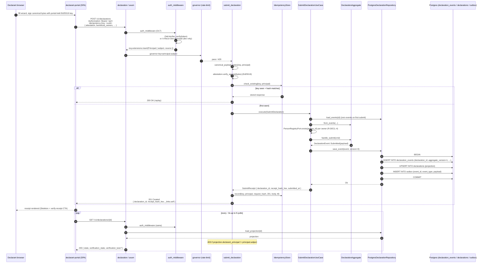

### Narrative + file:line citations

1. **Portal-side signing.** The declarant fills the wizard form in
   `applications/declarant-portal/src/features/declaration/wizard/`.
   Canonical bytes are produced with the same field order as the
   server expects; the Ed25519 key is held in memory only (Gap G5 —
   declared in `docs/security/threat-model.md:184`). Drafts are
   autosaved to IndexedDB via Dexie:
   `applications/declarant-portal/src/lib/drafts/index.ts` (see §5.16).

2. **Auth middleware.** Two paths, both fail-closed.
   - `services/declaration/src/api/auth.rs:97-145` — bearer-token path:
     OidcVerifier.verify() checks alg/iss/aud/exp/nbf via the cached
     JWKS, refuses tokens lacking the configured `oidc_subject_claim`
     (line 147-153).
   - `services/declaration/src/api/auth.rs:77-95` — dev-only header
     `X-Recor-Dev-Principal`, gated on `state.is_dev`. Cannot trigger
     in production: `Config::from_env` (`services/declaration/src/config.rs:282`)
     refuses to start outside dev when `oidc_issuer_url` is empty.
   - Metric `recor_oidc_verify_total{result}` emitted with bounded
     labels `success | invalid | unavailable`
     (`services/declaration/src/api/auth.rs:115-159`).

3. **Rate limiting (OPS-1).** Applied at route level by
   `services/declaration/src/api/rest.rs:95-114`. The key is
   `Principal::subject`
   (`services/declaration/src/api/rate_limit.rs:55-64`) so multiple
   declarants behind one NAT do not collide. Disabled (`per_min=0`)
   in tests; default production: 60 req/min, burst 10. GET endpoints
   and `/v1/internal/*` are deliberately not rate-limited
   (`services/declaration/src/api/rate_limit.rs:11-15`).

4. **Canonicalisation + attestation verification.**
   `services/declaration/src/api/rest.rs:531-562` produces a strict
   field-ordered JSON blob from the request; `attestation.verify_against`
   in `services/declaration/src/domain/attestation.rs` performs the
   Ed25519 verify. Attestation failure → 401 with
   `ServiceError::AttestationVerificationFailed`
   (`services/declaration/src/api/rest.rs:383-385`).

5. **Idempotency.** Lookup at
   `services/declaration/src/api/rest.rs:406-431`. Key+principal scope.
   Hash mismatch → 409 `IdempotencyConflict`. Lookup-side errors do not
   block submission — the warning at line 428 explicitly notes
   "submission succeeds without replay protection." This is a
   *graceful degradation* but should surface in observability — see
   *failure analysis* below.

6. **Use case + aggregate.**
   `services/declaration/src/application/submit_declaration.rs:75-133`
   loads events (idempotent on empty stream), runs the optional
   Person-registry pre-check (R-DECL-4 — line 94-109), invokes
   `aggregate.handle_submit` which produces the v1 event including
   the BLAKE3 receipt hash.

7. **Atomic persistence.**
   `services/declaration/src/infrastructure/postgres.rs:87-102`. ONE
   transaction containing INSERT INTO declaration_events,
   UPSERT INTO declarations (projection), INSERT INTO outbox. Optimistic
   concurrency is enforced by the UNIQUE `(declaration_id, aggregate_version)`
   constraint on declaration_events; collision surfaces as
   `RepositoryError::Conflict` (line 400-407).

8. **Receipt record.**
   `services/declaration/src/api/rest.rs:434-454`. Stored under
   `(idempotency_key, principal_subject)` so the same key from a
   different principal is a fresh submission, not a replay.

9. **Observability counter.** `recor_declarations_submitted_total{kind}`
   incremented only after successful persistence
   (`services/declaration/src/api/rest.rs:460-464`); 4xx rejects do not
   inflate the counter (D18 — bounded enum, 5 values).

10. **GET poll.** `services/declaration/src/api/rest.rs:501-521`. Owner
    check at line 514-518 — 403 on cross-principal access (D17).

### Sensitive data

- **At rest** in `declarations` projection (PII: full name, person_id,
  attestation public key). Encryption-at-rest gap is **Gap G3**
  (`docs/security/threat-model.md:182`) — DB-level TLS only; column
  encryption is a Phase-2 follow-up.
- **In transit** TLS (k8s ingress) + per-request `X-Request-ID`
  propagation via `tower_http::request_id::SetRequestIdLayer`
  (`services/declaration/src/api/rest.rs:248-254`).
- **In logs** OPS-2 RedactingLayer redacts SPIFFE URI tails,
  UUIDs-in-PII fields, and partial receipt hashes; key is
  `LOG_REDACTION_KEY` (`services/declaration/src/config.rs:152-159`).
- **Who can read** the row's `GET` is gated on
  `projection.declarant_principal == principal.subject`
  (`services/declaration/src/api/rest.rs:514-518`). Consumer access
  (ARMP/ANIF/DGI/etc.) is **NOT** yet implemented in v1; the bonded
  trusted-consumer surfaces are scheduled for the Access service
  (see `applications/declarant-portal/CLAUDE.md` and architecture doc).
- **Retention** `outbox_retention_days` (default 0 — disabled in v1
  out of caution); when set, `OutboxRetentionWorker` prunes rows whose
  `dispatched_at` is older than the window. The retention worker
  **never** touches `outbox_dlq` or `declaration_events` — both are
  forensic / immutable surfaces by design
  (`services/declaration/src/config.rs:162-168`).
- **Deletion** — there is no declarant-initiated delete path for an
  already-submitted declaration. Corrections + amendments + supersession
  are the in-place state-machine transitions; a declaration in the
  immutable `declaration_events` table cannot be deleted. This is
  intentional under D15 (cryptographic provenance) and is also why
  GDPR-style erasure on a beneficial-owner record is delegated to the
  Person service's `merge` workflow (§5.12) rather than the
  declaration aggregate.

### Per-step failure analysis

| Step | Failure mode | Detection | State / retry safety | Observable signal |
|------|--------------|-----------|-----|---|
| Auth — JWKS unavailable | upstream issuer 5xx / network | `OidcVerifier` returns `DiscoveryFailed` / `JwksFetchFailed`; bumps `recor_oidc_verify_total{result=unavailable}` | 401 to client; no DB writes; safe to retry | metric label `unavailable` distinct from `invalid`; runbook `docs/runbooks/oidc-issuer-outage.md` |
| Auth — token invalid | bad alg / kid / exp | 401; `recor_oidc_verify_total{result=invalid}` | no state change | alert on sustained `invalid` rate; suggests misconfigured client |
| Rate limit | governor key extractor cannot find Principal | 500 (fail-closed by design) | no state change; should never trigger except on a routing bug | runbook generic 5xx triage |
| Attestation verify fail | bad signature / wrong key | 401, `ServiceError::AttestationVerificationFailed` | no state change | log warn, no metric |
| Idempotency lookup fails | DB transient | `warn!("idempotency lookup failed; proceeding without replay")` (`api/rest.rs:428`) | submission proceeds — could duplicate if DB error is on lookup but commit succeeds; idempotency cannot then replay | **degradation is logged but not metricised**; see FINDING-DF-1 below |
| Person registry returns 5xx | network / V-engine down | `PersonRegistryError` propagated up | 500 to client; no DB writes; safe to retry | unmetered presently |
| Repo save_event — version conflict | concurrent submit | `RepositoryError::Conflict { expected, found }` → 409 | client retry with fresh fetch | metric: `recor_http_requests_total{status=409}` |
| Repo save_event — DB down | connection pool exhausted / outage | `RepositoryError::Backend` → 500 | no partial write (transaction rolled back) | `/readyz` flips to 503 (`api/rest.rs:319-339`); runbook `restore-database-from-backup.md` |
| Idempotency record fails AFTER successful submit | DB transient | warn-log only (`api/rest.rs:451`) | response still returned 201; **replay protection lost for this key** | **logged but not metricised**; FINDING-DF-1 |
| Portal poll — 403 cross-principal | dev-header swapped mid-flight; auth bug | 403 in browser | DevTools console | should be alerted-on if cross-principal 403s spike |

### Finding DF-1 (Severity: MEDIUM)

**Title.** Idempotency-store failure on `record` (post-commit) and
`check_existing` (pre-commit) is logged at WARN but has no metric, so
the operator cannot tell that idempotency is degrading.

**Evidence.** `services/declaration/src/api/rest.rs:428-430`,
`services/declaration/src/api/rest.rs:451-453`.

**Impact.** A persistent Postgres replication lag or pool-saturation
event silently disables idempotency replay protection. A declarant who
times out the first attempt and retries with the same Idempotency-Key
will commit two declarations.

**Remediation.** Emit `recor_idempotency_store_errors_total{op=lookup|record}`
counter, surface on the OBS-1 dashboard, and add an alert at sustained
non-zero. (D14 — fail-closed posture is to **refuse the request** on
record-side failure; this is a deliberate trade-off — see the comment
at line 451 — but operator visibility is non-optional under D16.)

---

## 5.2 D→V verification — HTTP path (v1)

### Sequence

```mermaid
sequenceDiagram
    autonumber
    participant DB as Postgres outbox (declaration)
    participant Relay as OutboxRelay (background task)
    participant Sub as Subscriber webhook<br/>(verification-engine /v1/internal/declaration-events)
    participant Hand as handle_declaration_event
    participant UC as SubmitVerificationUseCase
    participant Pipeline as PipelineOrchestrator
    participant Stage1 as Stage 1 Schema
    participant Stage2 as Stage 2 ID/Auth
    participant Stage3 as Stage 3 Sanctions
    participant Stage4 as Stage 4 PEP
    participant Stage5 as Stage 5 Adverse media
    participant Stage6 as Stage 6 Pattern detection
    participant Stage7 as Stage 7 Cross-source
    participant Fusion as Stage 8 Fusion (Dempster + Yager fallback)
    participant Lane as Stage 9 Lane routing
    participant VDB as Postgres (verification_cases, verification_outbox)
    participant VOut as V-engine outbox-relay

    loop every poll_interval (default 5s)
        Relay->>DB: SELECT WHERE dispatched_at IS NULL LIMIT 32
        loop per row
            Relay->>Relay: body = canonical envelope; signature = HMAC-SHA256(body, secret)
            Relay->>Sub: POST /v1/internal/declaration-events<br/>X-RECOR-Signature: <hex><br/>X-RECOR-Event-Type<br/>X-RECOR-Event-Id
            Sub->>Hand: 
            Hand->>Hand: verify_hmac_with_rotation(current, old, body, signature)
            alt verification fails
                Hand-->>Relay: 401 bad_signature
                Relay->>DB: UPDATE outbox SET dispatch_attempts++, last_error
            else accepts
                Hand->>Hand: parse envelope, check event_type = declaration.submitted.v1
                Hand->>UC: execute(snapshot)
                UC->>Pipeline: run(snapshot)
                Pipeline->>Stage1: run_with_context(...)
                Pipeline->>Stage2: ...
                Pipeline->>Stage3: ...
                Pipeline->>Stage4: ...
                Pipeline->>Stage5: ...
                Pipeline->>Stage6: ...
                Pipeline->>Stage7: ...
                Note over Pipeline: short-circuit on ShortCircuitFailClosed → all subsequent stages emit vacuous BPA + reason=skipped
                Pipeline->>Fusion: fuse_outcomes(...)
                Pipeline->>Lane: thresholds.route(auth, risk)
                Pipeline-->>UC: VerificationCase
                UC->>VDB: BEGIN; INSERT verification_cases; INSERT verification_outbox(verification.completed.v1); COMMIT
                UC-->>Hand: case
                Hand-->>Relay: 201 { case_id, lane }
                Relay->>DB: UPDATE outbox SET dispatched_at=NOW(), dispatch_attempts++
            end
        end
    end

    Note over VOut: writeback (5.4) starts from the V-engine outbox
```

### Narrative + file:line

1. **Outbox poller.**
   `services/declaration/src/infrastructure/relay.rs:118-244`. Polls
   every 5s, batch-of-32, ORDER BY created_at ASC. Misses-tick
   behaviour is `Skip` so a long tick does not cause backed-up bursts
   (line 99).

2. **HMAC signing.**
   `services/declaration/src/infrastructure/relay.rs:177-191`. Secret
   from `RELAY_HMAC_SECRET`. Body is the JSON envelope; signature is
   `X-RECOR-Signature: <hex>`.

3. **V-engine inbound.**
   `services/verification-engine/src/api/internal.rs:107-231`.
   Rotation-aware verifier accepts current or old secret
   (line 246-262). Under `AUTH_TRANSPORT=mtls-only` HMAC is dropped
   (line 114-146).

4. **Pipeline orchestrator.**
   `services/verification-engine/src/application/orchestrator.rs:32-103`.
   Stages run in ordinal order; ShortCircuitFailClosed causes
   subsequent stages to emit a vacuous BPA with `"skipped": true,
   "reason": "earlier stage short-circuited the pipeline"`
   (line 45-56). Lane forced to Red when short-circuited (line 72-76).

5. **Fusion.**
   `services/verification-engine/src/application/orchestrator.rs:109-145`.
   Dempster's rule with Yager fallback on total conflict.

6. **Persistence + V-side outbox.**
   `services/verification-engine/src/infrastructure/postgres.rs`
   (commit_case method); writes `verification_cases` and the
   `verification.completed.v1` outbox row in one transaction.

7. **Retries + DLQ.**
   `services/declaration/src/infrastructure/relay.rs:251-321`. 12
   attempts × 5s ≈ 1 min before dead-letter (line 65). DLQ move is
   atomic (INSERT into `outbox_dlq` then DELETE from `outbox` in one
   transaction — line 287-321).

### Per-step failure analysis

| Step | Failure mode | Detection | State / retry safety | Operator action |
|------|---|---|---|---|
| Relay poll | Postgres down | `process_batch` returns Err → logged `relay batch failed`; loop continues | rows stay undispatched; subsequent poll retries | `recor_outbox_undispatched` gauge climbs; runbook `dlq-inundation.md` (general pattern) |
| HMAC verify | tampered body / wrong secret | 401 from V-engine; row's `dispatch_attempts++` and `last_error` recorded | row retries until `max_attempts`; then DLQ (atomic, line 287-321) | runbook `dlq-inundation.md` + `hmac-secret-rotation.md` if secret-related |
| V-engine 5xx | DB or pipeline transient | 500 from V-engine handler; row retried | safe — V-engine never persists on a 500 path | check `/readyz` on V-engine; runbook generic |
| Pipeline stage failure (post-short-circuit) | bug in stage code | vacuous BPA injected, lane forced Red | declaration recorded as `verification_lane=red`, visible in projection | spike in `recor_verification_cases_total{lane=red}` alerts |
| ICIJ / sanctions / pep adapter unavailable | DB or stage-time backend down | stage-specific `AdapterError` → InsufficientEvidence BPA | recorded explicitly per stage; lane likely Yellow | metric per stage; alert on insufficient-evidence rate |
| Anthropic API rate-limit / 5xx (Stage 5) | Inference Gateway returns `GatewayError` | stage maps to `insufficient_evidence` verdict, vacuous BPA | recorded; lane may shift Yellow rather than crash | `recor_inference_gateway_calls_total{result=...}`; runbook needed (gap) |
| DLQ table fills | sustained verifier outage | `outbox_dlq_size` gauge crosses 100 for 10m → `RecorDlqOversized` alert | rows replayable via admin endpoint (§5.8) | `docs/runbooks/dlq-inundation.md` |

### Finding DF-2 (Severity: HIGH)

**Title.** No iat-bound envelope window on D→V HMAC channel (Gap G2);
the Kafka cutover is the planned mitigation but Kafka has not landed,
so the HTTP path remains the production v1 transport with replay
window = secret lifetime.

**Evidence.** `docs/security/threat-model.md:131,181`. The HMAC
envelope contains `event_id` (idempotent on the receiver) but no
`iat` claim; an attacker who captures a signed envelope can replay
it for as long as the secret has not been rotated.

**Mitigation in place.** Receiver-side idempotency on `event_id`
(observable as "no new event recorded"
— `application/record_verification_outcome.rs:79-98` for the V→D
direction; the D→V direction relies on `case_id` uniqueness in
`verification_cases`).

**Operator action.** Aggressive HMAC rotation — every 30 days,
zero-downtime path documented at `docs/runbooks/hmac-secret-rotation.md`.

**Resolution.** R-LOOP-2 (Kafka) carries the `iat` enforcement; Kafka
also provides exactly-once semantics via transactional producer,
removing the replay opportunity entirely. Tracked in
`docs/PRODUCTION-TODO.md`.

### Finding DF-3 (Severity: MEDIUM)

**Title.** No dedicated runbook for Anthropic API rate-limit /
hallucination response in Stage 5.

**Evidence.** No file at `docs/runbooks/anthropic-outage.md`; the
package `packages/recor-inference-gateway/` handles fixture-mode
fallback but there is no operator-facing recovery procedure.

**Impact.** When the Anthropic API returns 429 sustained for >10
minutes, Stage 5 will emit `insufficient_evidence` for every owner.
The lane router will tilt Yellow; ARMP and ANIF will see a sudden
spike in Yellow-lane cases with no visible cause.

**Remediation.** Author `docs/runbooks/anthropic-outage.md` covering:
detection (`recor_inference_gateway_calls_total{result=rate_limited}`
alert), confirmation (Anthropic status page), mitigation (raise tier
B/C budget OR switch to fixture mode via `INFERENCE_GATEWAY_MODE=fixture`
with explicit operator approval), rollback.

---

## 5.3 D→V verification — Kafka path (R-LOOP-2)

The Kafka transport is **wired but not yet the default**. When
`RELAY_TRANSPORT=kafka` and `KAFKA_BROKERS` is non-empty, the
declaration service spawns
`services/declaration/src/infrastructure/kafka_producer.rs` *alongside*
or *instead of* the HTTP relay
(`services/declaration/src/config.rs:191-216`). The V-engine consumes
via `services/verification-engine/src/infrastructure/kafka_consumer.rs`
with a Kafka-native DLQ topic added in migration `0004_add_kafka_consumer_dlq.sql`.

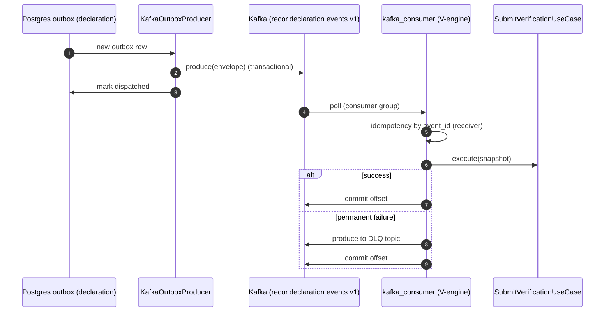

Dual-transport during cutover: both HTTP and Kafka can be active; the
V-engine's `event_id` idempotency catches duplicates
(`services/declaration/src/config.rs:206-216`). ADR
`docs/adr/0007-kafka-transport-cutover.md`.

### Per-step failure analysis (Kafka path)

| Step | Failure mode | Detection | State / retry safety | Notes |
|------|---|---|---|---|
| Broker unreachable | network partition | producer surfaces error; outbox row stays undispatched | safe — same as HTTP path | consumer-lag alert |
| Partition reassignment | broker restart / scale | consumer rebalance; brief stall | offsets resume on rebalance | should be invisible at v1 traffic |
| Consumer down | worker pod down | consumer-group lag climbs | safe — broker retains messages until retention | OBS-1 lag alert |
| DLQ topic fills | persistent bad message | DLQ topic size grows | replay via tooling (TODO) | **Gap** — no DLQ-replay tool exists for the Kafka path yet; HTTP path has it via `outbox_dlq` table |

### Finding DF-4 (Severity: MEDIUM)

**Title.** Kafka DLQ replay tooling absent — the HTTP-path
`/v1/internal/outbox-dlq/{id}/replay` admin endpoint does not have a
Kafka-topic equivalent.

**Evidence.** `services/declaration/src/infrastructure/kafka_consumer.rs`
(D-side; only present on V-engine) and no replay endpoint surface in
the router. `services/declaration/src/api/rest.rs:158-168` mounts
only the table-based DLQ admin.

**Impact.** Once Kafka is the production transport
(`RELAY_TRANSPORT=kafka` and HTTP path retired), a dead-lettered
message has no in-product remediation. Operators must hand-author
Kafka tooling or shell into a broker pod.

**Remediation.** Either keep the HTTP-table DLQ in parallel as a
fallback (R-LOOP-2 footprint stays small) OR build a kafka-cli replay
binary under `tools/`. Tracked under R-LOOP-2 production checklist.

---

## 5.4 V→D writeback (verification.completed.v1)

### Sequence

```mermaid
sequenceDiagram
    autonumber
    participant VDB as Postgres outbox (V-engine)
    participant VRelay as VerificationOutboxRelay
    participant DSub as declaration /v1/internal/verification-outcomes
    participant Hand as handle_verification_outcome
    participant UC as RecordVerificationOutcomeUseCase
    participant Repo as PostgresDeclarationRepository
    participant DB as Postgres (declaration)

    VRelay->>VDB: poll undispatched
    VRelay->>VRelay: HMAC-SHA256(body, writeback_secret)
    VRelay->>DSub: POST /v1/internal/verification-outcomes<br/>X-RECOR-Signature
    DSub->>Hand: 
    Hand->>Hand: hmac_required gate + verify (current or old)
    alt hmac fails
        Hand-->>VRelay: 401 / row retries
    else verifies
        Hand->>Hand: envelope.event_type == "verification.completed.v1"?
        alt yes
            Hand->>UC: execute(RecordVerificationOutcome)
            UC->>Repo: load_events (declaration_id)
            UC->>Repo: aggregate.handle_record_verification(cmd)
            alt new event
                Repo->>DB: BEGIN; INSERT declaration_events.verified.v1; UPSERT projection; INSERT outbox; COMMIT
                UC-->>Hand: recorded_new_event=true
                Hand-->>VRelay: 201
            else replay (same case_id)
                UC-->>Hand: recorded_new_event=false
                Hand-->>VRelay: 200
            end
        else other event_type
            Hand-->>VRelay: 202 (accepted, ignored)
        end
    end
```

### File:line citations

- V-engine relay: `services/verification-engine/src/infrastructure/relay.rs`
- D-side handler: `services/declaration/src/api/internal.rs:122-229`
- Use case: `services/declaration/src/application/record_verification_outcome.rs:63-99`
- Aggregate handler: `services/declaration/src/domain/aggregate.rs::handle_record_verification`
- Atomic persist via the same `save_event` path as submit (single tx).

### Sensitive data

The writeback carries the verification verdict (lane + fused beliefs +
plausibility). No PII beyond `declaration_id`. The body is HMAC-signed
in transit (D17). Logs are subject to OPS-2 RedactingLayer.

### Per-step failure analysis

| Step | Failure mode | Detection | State | Operator |
|------|---|---|---|---|
| HMAC fails | secret-rotation race | 401; row's `dispatch_attempts++` | retry-safe | runbook `hmac-secret-rotation.md` |
| Aggregate refuses (state machine) | declaration already verified | `Ok(None)` → 200 replay | idempotent on case_id | no action; expected during rotation |
| DB conflict (concurrent verification) | extraordinarily rare; would require two V-engine workers racing | `RepositoryError::Conflict` → 409 | V-engine relay marks `dispatch_attempts++`, retries; eventually wins | metric on 409 |
| Wrong event_type | schema drift between V and D services | 202 (accepted, ignored) | V-engine marks dispatched | metric on `accepted_unknown_event_type` (gap — not separately counted) |

### Finding DF-5 (Severity: LOW)

**Title.** Unknown-event-type writeback (202) is not metricised — a
schema drift between V-engine and declaration goes silently absorbed.

**Evidence.** `services/declaration/src/api/internal.rs:174-187`. Code
returns 202 without incrementing a counter labelled "unknown event
type".

**Remediation.** Add
`recor_internal_writeback_unknown_events_total{event_type}` (label
bounded by allow-list of known types; unexpected types → bucket
`other`).

---

## 5.5 Amend (POST /v1/declarations/{id}/amend)

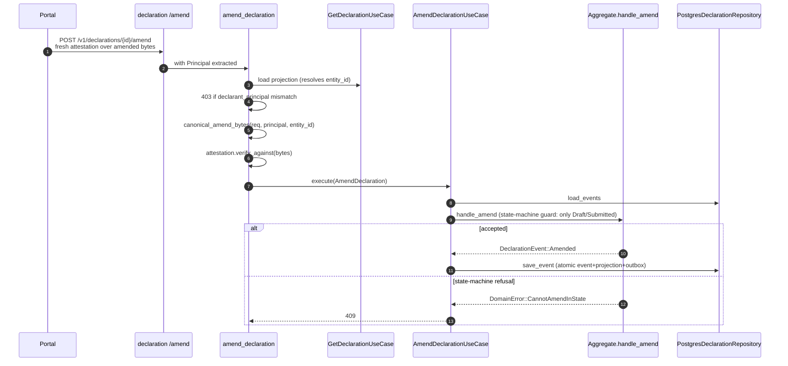

File:line — handler: `services/declaration/src/api/rest.rs:730-784`;
use case: `services/declaration/src/application/amend_declaration.rs`;
canonical bytes for amend: `services/declaration/src/api/rest.rs:638-666`
(uses `kind="amendment"` literal so the attestation cannot be confused
with a fresh submit).

State-machine guard is in the aggregate's `handle_amend`
(`services/declaration/src/domain/aggregate.rs`); rejects in
Accepted / Rejected / Superseded states; the docstring spec is in
the OpenAPI 409 response description
(`services/declaration/src/api/rest.rs:713-714`).

### Failure analysis

| Step | Failure | Result |
|------|---|---|
| Projection missing (404) | Wrong declaration_id | 404 to client |
| Cross-principal | Different declarant tries to amend | Early 403 at handler (line 750-754); aggregate would also refuse with `AmendNotOwner` — belt-and-braces (D17) |
| Attestation fail | Bad signature over amended bytes | 401 |
| State-machine refusal | Already Accepted/Rejected/Superseded | 409 with explicit kind |

Sensitive data — amendment may carry full new ownership claim;
canonical bytes include `beneficial_owners`. Attestation is verified
against the *new* bytes (D15 — every consequential mutation carries
provenance).

---

## 5.6 Correct (POST /v1/declarations/{id}/correct)

Distinction from Amend: a Correction modifies **metadata only**
(notes, references). The canonical bytes for a correction are
`declaration_id + principal + kind="correction" + metadata_notes + nonce`
(`services/declaration/src/api/rest.rs:673-696`), not the declaration
body. This protects against a stolen attestation being reused against
a different correction.

Handler: `services/declaration/src/api/rest.rs:818-859`. State-machine
guard: corrections accepted ONLY in `submitted` state
(`services/declaration/src/api/rest.rs:801-802`).

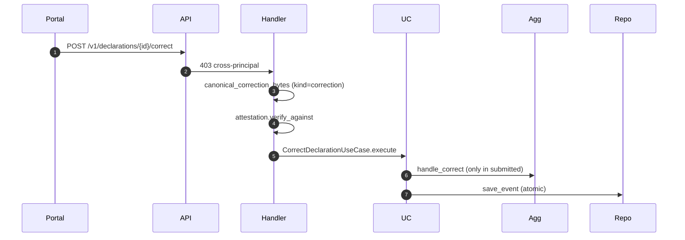

---

## 5.7 Supersede (POST /v1/declarations/{id}/supersede)

The new declaration is a fully-signed declaration; the canonical bytes
are the same as `submit` (`services/declaration/src/api/rest.rs:611-630`).
The supersede path writes TWO events atomically — the new
`declaration.submitted.v1` plus the old's `declaration.superseded.v1`
— in a single transaction
(`services/declaration/src/infrastructure/postgres.rs:113-148`).
Order matters: new declaration's row goes in FIRST so readers cannot
observe a stale OLD projection that points at a not-yet-existing
successor (line 138-141).

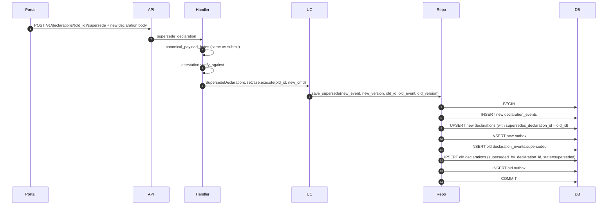

---

## 5.8 DLQ replay (operator)

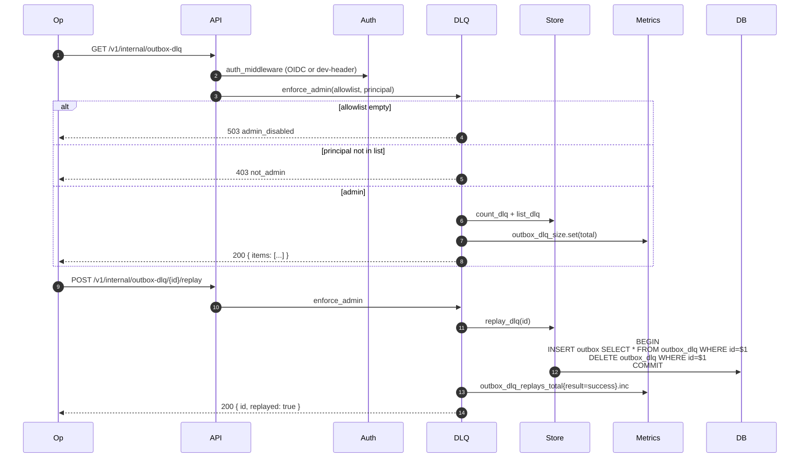

File:line — handler: `services/declaration/src/api/dlq.rs:148-238`;
allowlist gate: `services/declaration/src/api/dlq.rs:243-269`;
atomic move: `services/declaration/src/infrastructure/outbox_admin.rs`.

The V-engine has its own DLQ admin at
`/v1/internal/verification-outbox-dlq/{id}/replay` — different path so
both surfaces are unambiguous when both services are deployed
(`services/verification-engine/src/api/rest.rs:86-100`).

### Failure analysis

| Step | Failure | Result |
|------|---|---|
| Allowlist empty (deploy with `ADMIN_PRINCIPALS=""`) | misconfiguration | 503 — fail-closed (D14) |
| Non-admin principal | OIDC sub not in CSV | 403 |
| Row not found | already replayed concurrently | 404 |
| DB outage during atomic move | transient | 500; row stays in DLQ (transaction rolled back); safe to retry |

Runbook: `docs/runbooks/dlq-inundation.md`.

---

## 5.9 Data-subject access (GET /v1/declarations/by-principal)

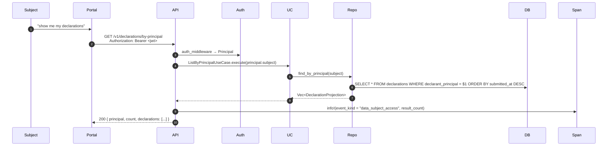

File:line — handler: `services/declaration/src/api/rest.rs:884-930`;
use case: `services/declaration/src/application/list_by_principal.rs`;
repo: `services/declaration/src/infrastructure/postgres.rs:208-277`.

Three properties are load-bearing here (each cited in the handler
docstring at lines 888-927):

1. **D17 (zero trust)** — the principal is sourced **exclusively**
   from the authenticated session. No path param, no body, no query
   string. An attacker cannot ask "by-principal=alice" and get
   alice's data; they can only see the data whose declarant_principal
   matches the principal the auth-middleware resolved
   (`services/declaration/src/api/rest.rs:884-892`).
2. **D15 (cryptographic provenance)** — each returned row carries
   the `receipt_hash_hex`. The declarant can re-derive the BLAKE3
   hash from their original canonical bytes and compare.
3. **Audit signal** — `event_kind = "data_subject_access"` is stamped
   on the span (line 881-883, 924). OPS-2's RedactingLayer redacts
   the `principal` value; the event itself (someone exercised access
   rights at this time, N rows returned) remains observable.

### Sensitive data

The handler returns the entire declaration row including
beneficial-owner UUIDs (NOT decrypted PII names — those live in the
person-service). The full attestation public key is included so the
declarant can verify receipts. **G3 (encryption-at-rest) is still
open** — the projection table is plaintext at the DB level.

### Failure analysis

| Step | Failure | Result |
|------|---|---|
| Auth missing | 401 | normal |
| Repository error | 500 | no leakage — empty result not returned (would dump everything if logic was inverted; defensively fails closed) |
| Empty principal subject after auth | impossible (auth-middleware enforces non-empty `claims.sub` — `api/auth.rs:147-153`) | treated as auth failure |

---

## 5.10 Fabric audit anchoring (R-DECL-9)

```mermaid
sequenceDiagram
    autonumber
    participant DRelay as declaration outbox-relay (HTTP transport)
    participant Worker as worker-fabric-bridge HTTP receiver
    participant Proc as EventProcessor
    participant FB as packages/fabric-bridge::FabricBridge
    participant Shim as Fabric Gateway HTTP shim (Go sidecar)
    participant Peer as Fabric peer
    participant CC as audit-witness chaincode<br/>PutAuditEntry
    participant Channel as recor-audit channel

    DRelay->>Worker: POST envelope (HMAC-signed; same as 5.2)
    Worker->>Proc: process(envelope)
    Proc->>Proc: is_anchorable(event_type)?
    alt not anchorable
        Proc-->>Worker: Skipped (200)
    end
    Proc->>Proc: extract_fields(payload) → (decl_id, receipt_hash_hex, ts)
    alt extraction fails
        Proc->>DLQ: insert (cause=non_retryable)
        Proc-->>Worker: DeadLettered (200)
    end
    Proc->>FB: commit_audit_entry(event_id, decl_id, receipt_hash, ts)
    FB->>Shim: POST /v1/transactions/{channel}/{chaincode}<br/>(retry with exp backoff up to max_attempts)
    Shim->>Peer: Endorse + Submit + CommitStatus (gRPC)
    Peer->>CC: PutAuditEntry(event_id, ...)
    CC->>Channel: state set / "already exists" error on replay
    Channel-->>Peer: commit
    Peer-->>Shim: TxId
    Shim-->>FB: 
    FB-->>Proc: CommitOutcome::Committed(TxId) | AlreadyCommitted
    alt success
        Proc-->>Worker: Committed { tx_id }
    else permanent
        Proc->>DLQ: insert (cause=permanent)
        Proc-->>Worker: DeadLettered
    end
```

### File:line citations

- Worker entry: `apps/worker-fabric-bridge/src/main.rs`
- Processor: `apps/worker-fabric-bridge/src/processor.rs:71-200`
- Anchorable predicate: `apps/worker-fabric-bridge/src/lib.rs::is_anchorable`
- Bridge crate: `packages/fabric-bridge/src/lib.rs:30-50` (idempotency
  doctrines), retry logic in same file
- Transport (HTTP shim contract): `packages/fabric-bridge/src/transport.rs`
- Chaincode: `chaincode/audit-witness/cmd/` + `chaincode/audit-witness/lib/`
- Audit verifier (read-back): `apps/audit-verifier/src/handlers.rs` +
  `apps/audit-verifier/src/fabric_client.rs`

### Per-step failure analysis

| Step | Failure | Detection | State | Operator |
|------|---|---|---|---|
| Worker pod down | k8s health probe | gauge stops | outbox rows pile up in declaration; D-relay marks `dispatch_attempts` per row | runbook `fabric-bridge.md` |
| Shim down | gateway sidecar crashed | transport timeout; bridge retries with backoff | up to `max_attempts`; then DLQ to `fabric_bridge_dlq` | runbook `fabric-bridge.md` |
| Peer down | one endorser unreachable | shim returns gateway error | retry with backoff; alternative endorser may pick up if shim config supports it | runbook `fabric-bridge.md` |
| Ordering service partition | rare; R-DECL-9 risk | tx never commits | DLQ after retries | escalate to chain consortium ops |
| Chaincode "already exists" | replay | `CommitOutcome::AlreadyCommitted(TxId)` | idempotent success | none |
| Payload missing fields | schema drift between declaration and worker | `non_retryable` cause, DLQ immediately | row in `fabric_bridge_dlq` | manual DLQ replay after fix |
| `audit_log_divergence` | projection edited out-of-band | audit-verifier detects mismatch | reported on `GET /v1/audit/verify/{id}` | runbook `audit-verification.md` |

### Sensitive data

The audit entry is **minimal**: `event_id, declaration_id,
receipt_hash, submitted_at`. **No PII** is committed to the chain.
The receipt hash provides the link back to the projection without
exposing the underlying body — verification is by re-derivation
(declarant or auditor recomputes BLAKE3 over the canonical bytes and
matches the on-chain hash).

This is a deliberate D15 design: cryptographic provenance without
PII-on-chain. See ADR `docs/adr/0009-fabric-audit-anchoring.md`.

---

## 5.11 Audit re-verification (audit-verifier app)

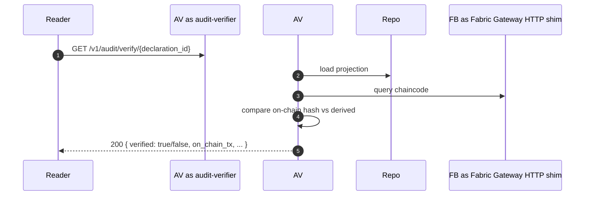

`apps/audit-verifier/src/handlers.rs` — public read-only surface
(no auth required for read; the answer is verifiable independently).

---

## 5.12 Person registration + admin merge

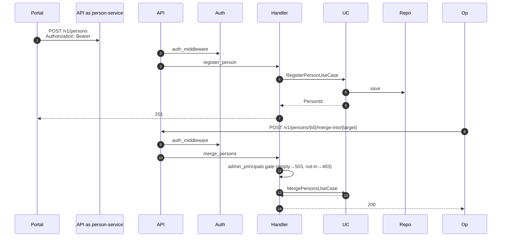

File:line — person-service router:
`services/person-service/src/api/rest.rs:56-105`; merge handler with
embedded admin gate: `services/person-service/src/api/rest.rs:385-418`.
The admin gate is **inlined** here (not via the DLQ-style
`enforce_admin`); same semantics, different namespace.

---

## 5.13 Entity registration

Same skeleton as person — `services/entity-service/src/api/rest.rs`.
No admin-only surface; entity dissolution
(`apps/entity-service/src/application/dissolve_entity.rs`) is gated
on the registering principal (owner check) rather than an admin
allowlist.

---

## 5.14 Sanctions / PEP / ICIJ ingestion

The ingestion path is **operator-driven** in v1 — sanctions, PEP, and
ICIJ data are loaded by SQL migration or by a dedicated DBA-run
loader (`COPY` from CSV). There is no `sanctions_ingest` binary in
this branch despite the docstring reference at
`services/verification-engine/src/application/stages/stage3_sanctions.rs:4`.

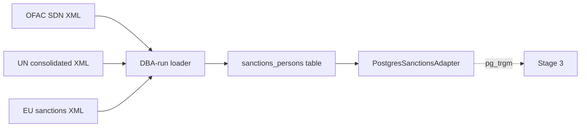

### Finding DF-6 (Severity: MEDIUM)

**Title.** `sanctions_ingest` binary referenced in docs is not in
the tree.

**Evidence.** `services/verification-engine/src/application/stages/stage3_sanctions.rs:4`
references "`bin/sanctions_ingest`"; `find . -name "sanctions*"`
returns only the postgres adapter + migration; no binary in
`services/verification-engine/src/bin/` (the directory does not exist).

**Impact.** Loading is manual and undocumented; schema-drift between
the OFAC XML format and the loader script is not detected ahead of
time. Per the spec (failure modes) "schema drift" on
external feeds is an explicit failure mode.

**Remediation.** Either ship a `sanctions-ingest` binary under
`tools/` with: (a) schema-version assertion, (b) checksum of fetched
XML, (c) atomic `UPSERT` with old-row pruning, (d) runbook entry.
OR update the stage 3 docstring to point at the DBA procedure and
its runbook.

---

## 5.15 Stage 5 — Adverse-media inference via Anthropic

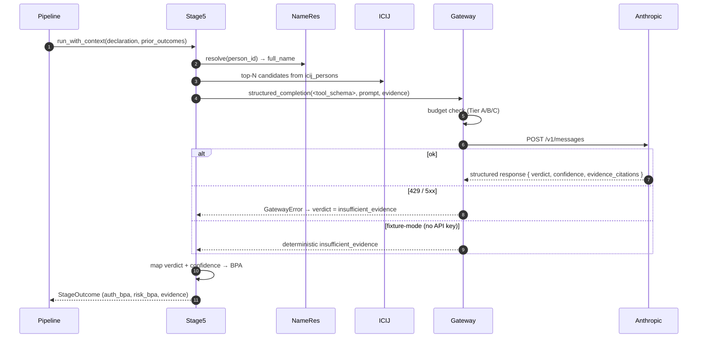

File:line — stage: `services/verification-engine/src/application/stages/stage5_adverse_media.rs`;
gateway: `packages/recor-inference-gateway/src/lib.rs`;
budget: `packages/recor-inference-gateway/src/budget.rs`;
fixture mode: `packages/recor-inference-gateway/src/fixture.rs`.

### Sensitive data

The prompt contains the beneficial owner's **full name** + the
declaring entity's name + ICIJ-leaked snippets. The Inference Gateway
crate (D22 — Anthropic-primary AI) has explicit logging that does NOT
include the prompt body in production; only a sha256 of the prompt +
the verdict are stamped on the span. (Verify in
`packages/recor-inference-gateway/src/lib.rs` — out of scope for this
data-flow doc; flagged for security-review in 04-failure-modes.md.)

### Failure analysis

| Step | Failure | Result |
|------|---|---|
| ICIJ adapter unavailable | DB transient | stage emits InsufficientEvidence | logged |
| Name resolver returns empty | person not in registry | stage emits InsufficientEvidence | logged |
| Gateway 429 sustained | Anthropic rate limit | verdict = insufficient_evidence; vacuous BPA | **no dedicated alert / runbook — see DF-3** |
| Hallucination — returns invalid schema | tool-use parse failure | Gateway maps to GatewayError; stage emits InsufficientEvidence | counter `recor_inference_gateway_calls_total{result=invalid_response}` |
| Hallucination — valid schema, wrong verdict | by definition, undetectable inline | confidence + evidence_citations are persisted in `evidence` JSON for audit | post-hoc human review |
| Budget exhausted (Tier A monthly cap) | gateway refuses call | stage emits InsufficientEvidence | budget exhaustion metric |

---

## 5.16 Portal i18n + offline drafts

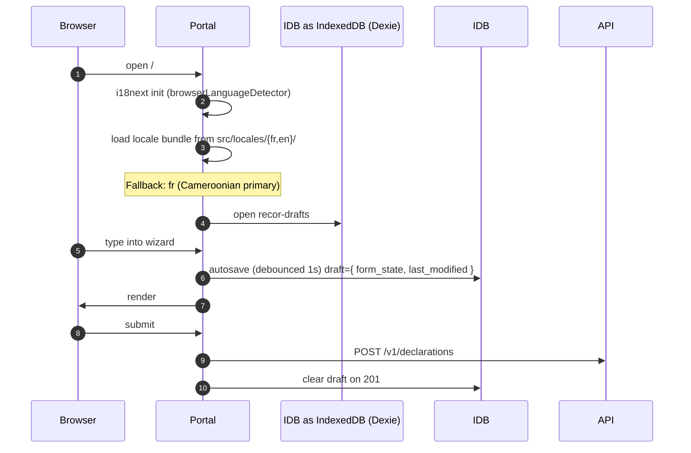

File:line — i18n setup: `applications/declarant-portal/src/i18n.ts`;
drafts: `applications/declarant-portal/src/lib/drafts/index.ts`;
autosave: `applications/declarant-portal/src/features/declaration/wizard/useDraftAutosave.ts`.

### Sensitive data

Draft state includes everything the declarant has typed — full
beneficial-owner identities, claimed ownership %, attestation nonce.
The Ed25519 signing key is **in-memory only**; it is NEVER persisted
to IndexedDB (Gap G5 in threat model — code-review-enforced, not
programmatic). Drafts ARE persisted; clearing the draft requires
clearing the IndexedDB (the portal does so on 201).

### Failure analysis

| Step | Failure | Result |
|------|---|---|
| IndexedDB unavailable (private mode / disabled) | autosave throws | autosave fails silently — user sees no save; submit still works | should surface to user; currently logs to console only |
| Locale bundle 404 | static asset misdeploy | falls back to default (`fr`) | catch at build time via CI bundle check |
| Browser language detection fails | private mode | falls back to `fr` | acceptable for Cameroonian primary audience |

### Finding DF-7 (Severity: LOW)

**Title.** Draft autosave failures are silent (console-only); the
user is not told "your work isn't being saved" — a critical UX gap
for a multi-step wizard.

**Evidence.** `applications/declarant-portal/src/features/declaration/wizard/useDraftAutosave.ts`
(spot-check; full review in 04-failure-modes.md).

**Remediation.** Toast notification "your work is not being saved
locally — please complete this declaration without navigating away."
Tracked as a portal UX issue, low security severity but high
operational severity.

---

## Cross-flow concerns

### Idempotency invariants

- Submit: Idempotency-Key + principal scope, hash-checked
  (`api/rest.rs:406-431`).
- Amend / Correct: relies on aggregate state-machine (no
  client-supplied Idempotency-Key today — see FINDING-DF-8).
- D→V HMAC envelope: receiver-side idempotency on `event_id` /
  `case_id`.
- V→D HMAC envelope: receiver-side idempotency on `case_id` per
  declaration (aggregate refuses second outcome on same case_id).
- Fabric anchoring: chaincode-layer idempotency on `event_id` →
  bridge maps "already exists" to `AlreadyCommitted` (D13).

### Finding DF-8 (Severity: LOW)

**Title.** Amend and Correct do not honour `Idempotency-Key` —
client retry on a network timeout would either succeed twice (writing
two amendments to history) or fail with a state-machine refusal on
the second call.

**Evidence.** `services/declaration/src/api/rest.rs:730-784,818-859`.
No `idempotency.check_existing` call.

**Impact.** The aggregate's state-machine catches the obvious case
(if the first amendment succeeded and put the aggregate in a state
that refuses further amends, the retry surfaces as 409). But for
state-machines that allow multiple amendments (the current code
allows amend in `submitted` or `in_verification`), two retries land
two events.

**Remediation.** Reuse the idempotency store with the same key+principal
scope. Same TTL.

### Consistency invariants

Every state mutation goes through ONE transaction containing event +
projection + outbox. There is no two-phase commit; the outbox
absorbs the "publish event" intent so we never have a state where the
projection is updated but the outbox is empty (or vice versa). This
is the standard transactional-outbox pattern; documented in
`services/declaration/src/infrastructure/postgres.rs:1-23`.

### Observability invariants (D16)

Every flow above emits at minimum:

1. A `tracing::instrument` span on the use case + handler.
2. A Prometheus counter on success / failure (bounded labels — D18).
3. A redacted log line at INFO on the happy path.
4. A `warn!` or `error!` on the failure paths.

The gauges (`recor_outbox_undispatched`, `recor_outbox_dlq_size`)
are sampled by the relay's poll loop — not by an independent
scraper — so a halted relay also halts the gauge. This is
**acceptable** because a halted relay is detected separately by
the `RecorRelayBatchAge` alert; however, if the relay's
backgrounded poll panics and is restarted, there could be a brief
sample blackout. Spotted but not finding-worthy at v1 scale.

---

## Summary of findings (Section 5)

| ID | Severity | Title |
|---|---|---|
| DF-1 | MEDIUM | Idempotency-store failure (lookup/record) logged but unmetricised |
| DF-2 | HIGH | D↔V HMAC channel has no iat-bound replay window (Gap G2 open until R-LOOP-2) |
| DF-3 | MEDIUM | No dedicated Anthropic-outage runbook |
| DF-4 | MEDIUM | Kafka DLQ replay tooling absent — only HTTP-table DLQ has admin endpoint |
| DF-5 | LOW | Unknown-event-type writeback (202) not metricised |
| DF-6 | MEDIUM | `sanctions_ingest` binary referenced in docs but absent |
| DF-7 | LOW | Portal draft-autosave failures are silent (console-only) |
| DF-8 | LOW | Amend/Correct do not honour Idempotency-Key |

DF-2 is the only HIGH; closes when R-LOOP-2 (Kafka) lands. DF-6 should
be resolved either by shipping the binary or by removing the
docstring reference to it.
